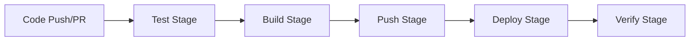

# CI/CD Pipeline Documentation

## Overview

The AegisTrader CI/CD pipeline is built on GitHub Actions and automates the entire software delivery process from code commit to staging deployment. The pipeline ensures code quality, builds secure container images, and deploys to Kubernetes environments.

## Pipeline Architecture

### Pipeline Stages



1. **Trigger Stage**: Activates on push to main branch or pull request events
2. **Test Stage**: Runs comprehensive testing suite including:
   - Python linting with ruff
   - Code formatting verification with black
   - Type checking with mypy (100% annotation coverage required)
   - Unit and integration tests with pytest (80% minimum coverage)
3. **Build Stage**: Creates multi-platform Docker images for:
   - monitor-api (FastAPI backend)
   - monitor-ui (Next.js frontend)
4. **Push Stage**: Pushes images to GitHub Container Registry (main branch only)
5. **Deploy Stage**: Deploys to staging environment using Helm (main branch only)
6. **Verify Stage**: Runs deployment verification and smoke tests

## Environment Variables and Secrets

### Repository Secrets Required

Configure these secrets in GitHub repository settings:

| Secret Name | Description | Example Value |
|-------------|-------------|---------------|
| `KUBE_CONFIG` | Base64-encoded Kubernetes config file | `base64 ~/.kube/config` |
| `GITHUB_TOKEN` | Automatically provided by GitHub Actions | (automatic) |

### Environment Variables

These are configured in the workflow file:

| Variable | Value | Description |
|----------|-------|-------------|
| `PYTHON_VERSION` | `3.13` | Python version for testing |
| `NODE_VERSION` | `20` | Node.js version for frontend builds |
| `REGISTRY` | `ghcr.io` | Container registry URL |
| `IMAGE_PREFIX` | `${{ github.repository }}` | Image name prefix |

## Image Tagging Strategy

Images are tagged using the following convention:

- **Main branch**:
  - `latest` (always points to the most recent main build)
  - `main-{sha}` (first 7 characters of commit SHA)
- **Pull requests**: `pr-{number}-{sha}`
- **Release tags**: Semantic version when tags are pushed (e.g., `v1.0.0`)

Example: `ghcr.io/your-org/aegistrader/monitor-api:main-abc1234`

## Troubleshooting Guide

### Common Pipeline Failures

#### 1. Test Stage Failures

**Symptom**: Pipeline fails during linting, type checking, or tests

**Common Causes**:
- Missing type annotations (mypy requires 100% coverage)
- Code formatting issues (black)
- Linting violations (ruff)
- Test failures or insufficient coverage (<80%)

**Resolution**:
```bash
# Run locally before pushing
ruff check .
black .
mypy . --strict
pytest --cov=. --cov-fail-under=80
```

#### 2. Docker Build Failures

**Symptom**: Build stage fails to create images

**Common Causes**:
- Missing dependencies in requirements.txt
- Dockerfile syntax errors
- Network issues during package installation

**Resolution**:
```bash
# Test build locally
docker build -t test-image ./apps/monitor-api/
docker build -t test-image ./apps/monitor-ui/
```

#### 3. Registry Push Failures

**Symptom**: Cannot push images to GitHub Container Registry

**Common Causes**:
- Insufficient permissions
- Registry quota exceeded
- Network connectivity issues

**Resolution**:
- Verify GitHub Actions has write permissions to packages
- Check organization/repository package settings
- Retry the workflow

#### 4. Kubernetes Deployment Failures

**Symptom**: Deployment to staging fails

**Common Causes**:
- Invalid KUBE_CONFIG secret
- Namespace conflicts
- Resource constraints
- Helm chart syntax errors

**Resolution**:
```bash
# Verify kubeconfig locally
kubectl config view
kubectl get nodes

# Check Helm chart
helm lint ./helm/
helm template ./helm/ --values helm/values.staging.yaml
```

#### 5. Deployment Verification Failures

**Symptom**: Services deployed but health checks fail

**Common Causes**:
- Services not ready yet
- Incorrect service configuration
- Database connection issues
- NATS cluster problems

**Resolution**:
```bash
# Check pod status
kubectl -n aegis-staging get pods
kubectl -n aegis-staging describe pod <pod-name>
kubectl -n aegis-staging logs <pod-name>

# Check NATS cluster
kubectl -n aegis-staging exec -it deployment/nats-box -- nats server ping
```

## Manual Deployment Override Procedures

### Emergency Deployment to Staging

When automated deployment fails but manual deployment is required:

```bash
# 1. Build and push images manually
docker build -t ghcr.io/your-org/aegistrader/monitor-api:emergency-fix ./apps/monitor-api/
docker push ghcr.io/your-org/aegistrader/monitor-api:emergency-fix

# 2. Deploy with Helm
cd helm
./generate-helm-values.sh
helm upgrade --install aegis-staging . \
  --namespace aegis-staging \
  --values values.deployment.yaml \
  --set global.imageTag=emergency-fix \
  --timeout 10m \
  --wait

# 3. Verify deployment
kubectl -n aegis-staging get pods
kubectl -n aegis-staging get svc
```

### Rollback Procedure

If a deployment causes issues:

```bash
# List Helm releases
helm list -n aegis-staging

# Rollback to previous version
helm rollback aegis-staging -n aegis-staging

# Or rollback to specific revision
helm rollback aegis-staging 3 -n aegis-staging

# Verify rollback
kubectl -n aegis-staging get pods -w
```

### Skip CI/CD for Emergency Fixes

To bypass CI/CD checks in emergencies, include `[skip ci]` in commit message:

```bash
git commit -m "Emergency fix: [skip ci]"
```

**WARNING**: This skips all quality checks. Use only in genuine emergencies.

## Pipeline Maintenance

### Updating Dependencies

1. Update Python dependencies:
   ```bash
   # Update requirements files
   pip-compile --upgrade requirements.in
   ```

2. Update GitHub Actions:
   - Check for new versions of actions used
   - Update in `.github/workflows/ci-cd.yml`

3. Update base images:
   - Review Dockerfile base images
   - Update to latest security patches

### Monitoring Pipeline Performance

- Check GitHub Actions usage and billing
- Monitor build times and optimize if needed
- Review test execution times
- Check image sizes and optimize layers

## Security Considerations

1. **Never commit secrets**: All sensitive data must use GitHub Secrets
2. **Image scanning**: Trivy scans all images for vulnerabilities
3. **Least privilege**: CI/CD service account has minimal required permissions
4. **Audit trail**: All deployments are logged in GitHub Actions history

## Support

For CI/CD pipeline issues:
1. Check this troubleshooting guide
2. Review GitHub Actions logs
3. Check Kubernetes cluster status
4. Contact DevOps team if issues persist
