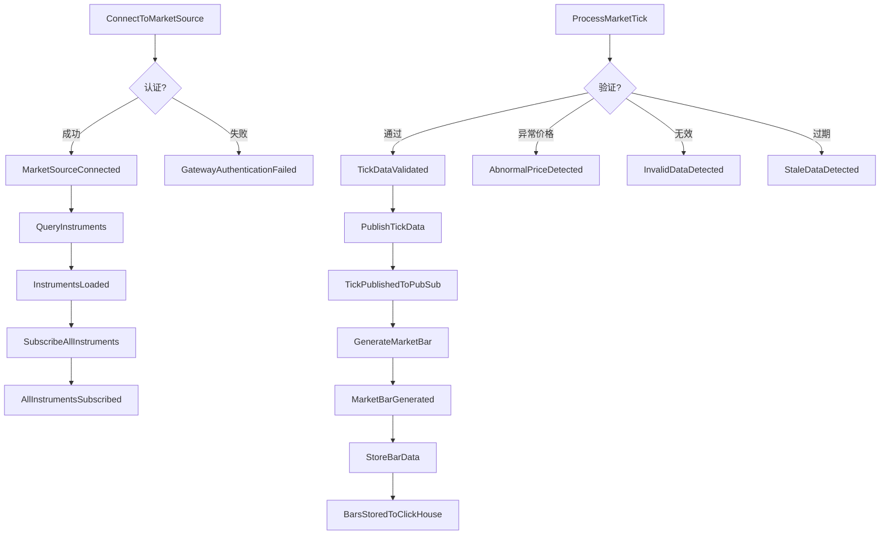

# 行情服务 DDD 设计 - Phase 1: 领域探索 (增强版)

## 业务需求

构建多市场实时行情服务，接收CTP（期货）和SOPT（股票期权）数据，验证质量后通过PubSub发布Tick事件，并存储分钟K线到ClickHouse。

## 业务不变量 (Business Invariants)

1. **数据唯一性**: 每个合约在同一时刻只能有一个有效的Tick数据
2. **时间对齐**: Bar数据的时间戳必须对齐到分钟边界 (HH:MM:00)
3. **价格合理性**: 涨跌停价格必须在合理范围内（期货±10%，期权±30%）
4. **成交量单调性**: 成交量必须为非负数且在交易时段内单调递增
5. **盘口价格序列**: 五档盘口必须满足：bid1 > bid2 > ... > bid5, ask1 < ask2 < ... < ask5
6. **连接唯一性**: 同一数据源同时只能有一个活跃连接
7. **订阅完整性**: 必须在收到合约列表后才能订阅行情
8. **数据时效性**: Tick数据时间戳与系统时间差不能超过5秒

## 领域事件识别（Event Storming）

### Actors（参与者）及职责

#### **Market Operator** - 市场操作员
- **职责**: 网关配置管理、连接控制、手动干预、监控告警处理
- **权限**: 启停服务、修改订阅列表、调整验证规则、查看监控指标
- **触发命令**: ConnectToMarketSource, DisconnectFromMarketSource, UpdateSubscriptionList, AdjustValidationRules

#### **System (Automated)** - 自动化系统
- **职责**: 自动重连、数据验证、K线生成、异常检测、数据存储
- **限制**: 不能修改配置、不能主动断开正常连接、遵循预设规则
- **触发命令**: ProcessMarketTick, ValidateMarketData, GenerateMarketBar, StoreBarData, RetryConnection

#### **Market Exchange** - 交易所（外部系统）
- **角色**: 外部数据源
- **行为**: 推送Tick数据、发送合约信息、维持心跳、发送交易状态
- **特征**: 不可控、需要适配、可能断连

### Domain Events（领域事件）

#### **网关生命周期事件**
- `GatewayInitialized` - 网关初始化完成
- `GatewayAuthenticationSucceeded` - 网关认证成功
- `GatewayAuthenticationFailed` - 网关认证失败
- `MarketSourceConnected` - 数据源已连接
- `MarketSourceDisconnected` - 数据源断开
- `ConnectionRetryScheduled` - 重连已计划
- `ConnectionRetryExhausted` - 重连次数耗尽

#### **合约管理事件**
- `ContractDataRequested` - 请求合约数据
- `ContractDataReceived` - 收到合约信息
- `InstrumentsLoaded` - 合约列表加载完成
- `SubscriptionRequested` - 请求订阅
- `InstrumentSubscribed` - 单个合约订阅成功
- `AllInstrumentsSubscribed` - 全部合约订阅完成
- `SubscriptionFailed` - 订阅失败

#### **交易时段事件**
- `PreMarketOpened` - 盘前开启
- `TradingSessionOpened` - 交易时段开启
- `TradingSessionPaused` - 交易暂停
- `TradingSessionResumed` - 交易恢复
- `TradingSessionClosed` - 交易时段关闭
- `MarketHalted` - 市场停牌
- `AfterHoursOpened` - 盘后开启

#### **数据接收事件**
- `MarketTickReceived` - 收到Tick数据
- `HeartbeatReceived` - 收到心跳信号
- `MarketStatusReceived` - 收到市场状态

#### **数据质量事件**
- `TickDataValidated` - Tick数据验证通过
- `InvalidDataDetected` - 检测到无效数据
- `AbnormalPriceDetected` - 检测到异常价格
- `StaleDataDetected` - 检测到过期数据
- `DataGapDetected` - 检测到数据断档
- `DuplicateDataDetected` - 检测到重复数据
- `DataQualityDegraded` - 数据质量下降
- `DataQualityRestored` - 数据质量恢复

#### **数据处理事件**
- `TickPublishedToPubSub` - Tick已发布到PubSub
- `MarketBarGenerated` - 分钟K线生成
- `BarDataAggregated` - K线数据聚合完成
- `BarsStoredToClickHouse` - K线已存储到ClickHouse
- `StorageRetryScheduled` - 存储重试已计划

#### **系统监控事件**
- `NetworkLatencyExceeded` - 网络延迟超标
- `MemoryThresholdExceeded` - 内存使用超限
- `ProcessingBacklogDetected` - 处理积压检测
- `SystemResourcesNormal` - 系统资源正常

#### **复合事件（业务流程完成）**
- `MarketOpeningSequenceCompleted` - 开市序列完成（初始化→认证→连接→加载合约→订阅→接收数据）
- `MarketClosingSequenceCompleted` - 收市序列完成（停止接收→生成日终K线→数据归档→断开连接）
- `TickProcessingPipelineCompleted` - Tick处理流水线完成（接收→验证→转换→发布→存储）
- `DisasterRecoveryActivated` - 灾备切换激活

### Commands（命令）

#### **连接管理命令**
| 命令 | 触发者 | 可能产生的事件 |
|------|--------|----------------|
| `InitializeGateway` | Market Operator | → `GatewayInitialized` / `GatewayInitializationFailed` |
| `ConnectToMarketSource` | Market Operator | → `GatewayAuthenticationSucceeded` + `MarketSourceConnected` / `GatewayAuthenticationFailed` |
| `DisconnectFromMarketSource` | Market Operator | → `MarketSourceDisconnected` |
| `RetryConnection` | System | → `MarketSourceConnected` / `ConnectionRetryScheduled` / `ConnectionRetryExhausted` |

#### **合约订阅命令**
| 命令 | 触发者 | 可能产生的事件 |
|------|--------|----------------|
| `QueryInstruments` | System | → `ContractDataRequested` → `ContractDataReceived` → `InstrumentsLoaded` |
| `SubscribeInstrument` | System/Operator | → `SubscriptionRequested` → `InstrumentSubscribed` / `SubscriptionFailed` |
| `SubscribeAllInstruments` | System/Operator | → `AllInstrumentsSubscribed` |
| `UpdateSubscriptionList` | Market Operator | → `SubscriptionUpdated` |

#### **数据处理命令**
| 命令 | 触发者 | 可能产生的事件 |
|------|--------|----------------|
| `ProcessMarketTick` | System | → `MarketTickReceived` → `TickProcessingPipelineCompleted` |
| `ValidateMarketData` | System | → `TickDataValidated` / `InvalidDataDetected` / `AbnormalPriceDetected` / `StaleDataDetected` |
| `PublishTickData` | System | → `TickPublishedToPubSub` |
| `GenerateMarketBar` | System | → `MarketBarGenerated` → `BarDataAggregated` |
| `StoreBarData` | System | → `BarsStoredToClickHouse` / `StorageRetryScheduled` |

#### **监控管理命令**
| 命令 | 触发者 | 可能产生的事件 |
|------|--------|----------------|
| `MonitorSystemHealth` | System | → `SystemResourcesNormal` / `MemoryThresholdExceeded` / `NetworkLatencyExceeded` |
| `CheckDataQuality` | System | → `DataQualityDegraded` / `DataQualityRestored` |
| `AdjustValidationRules` | Market Operator | → `ValidationRulesUpdated` |

## 命令-事件决策树



## 与vnpy框架的映射关系

### 事件类型映射
```python
# DDD Event → vnpy Event Type
EVENT_MAPPING = {
    "MarketTickReceived": EVENT_TICK,
    "MarketBarGenerated": EVENT_BAR,
    "MarketSourceConnected": EVENT_GATEWAY + ".connected",
    "MarketSourceDisconnected": EVENT_GATEWAY + ".disconnected",
    "ContractDataReceived": EVENT_CONTRACT,
    "TradingSessionOpened": EVENT_TRADING + ".opened",
    "TradingSessionClosed": EVENT_TRADING + ".closed",
}
```

### 数据结构对齐
```python
# DDD Domain Model → vnpy Data Structure
DATA_MAPPING = {
    "MarketTick": "TickData",
    "MarketBar": "BarData",
    "Instrument": "ContractData",
    "MarketGateway": "BaseGateway",
    "CtpMarketGateway": "CtpGateway",
    "SoptMarketGateway": "SoptGateway",
}
```

---

## Phase 1 完成总结

### 已识别的核心概念
- **3个 Actors** - 职责明确，边界清晰
- **46个 Domain Events** - 覆盖完整业务流程
- **16个 Commands** - 包含所有操作场景
- **8个 Business Invariants** - 确保数据一致性
- **清晰的命令-事件映射** - 包含成功/失败路径
- **vnpy框架集成方案** - 确保技术可行性

### 关键设计决策
1. 将网关生命周期作为独立的事件流，便于监控和故障恢复
2. 区分数据质量事件和数据处理事件，支持细粒度的质量控制
3. 引入复合事件概念，标识关键业务流程的完成
4. 明确Actor权限边界，确保系统安全性
5. 定义业务不变量，作为后续聚合设计的基础

Phase 1 领域探索完成。请确认是否进入 Phase 2：战略设计（Strategic Design）？
