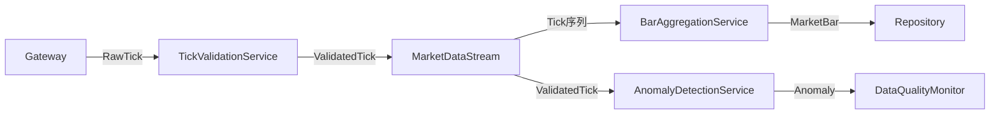

# 行情服务 DDD 设计 - Phase 3: 战术设计 (Market Data Context)

## 设计理念

Market Data Context作为核心域，承载着数据质量保证的关键职责。我们采用**小聚合原则**，确保每个聚合只管理自己的一致性边界，通过领域服务协调跨聚合的业务逻辑。

## 聚合设计

### 聚合划分策略

基于一致性边界和事务需求，我们识别出三个核心聚合：

| 聚合 | 核心职责 | 一致性边界 | 关键不变量 |
|------|---------|-----------|------------|
| **MarketDataStream** | 管理单个合约的实时数据流 | 同一合约的Tick时序 | • Tick时间戳单调递增<br>• 成交量单调递增<br>• 价格在涨跌停范围内 |
| **MarketBar** | 固定时间窗口的OHLCV数据 | 单个K线的完整性 | • High ≥ Low<br>• High ≥ Open, Close<br>• Low ≤ Open, Close |
| **DataQualityMonitor** | 监控数据质量和异常检测 | 质量指标和规则集 | • 质量分数范围 0-100<br>• 监控窗口不重叠 |

### 聚合根设计原则

```yaml
MarketDataStream:
  identity: {symbol, exchange}
  commands:
    - ProcessTick: 验证并处理新Tick
    - GenerateBar: 生成时间窗口内的K线
    - UpdateTradingStatus: 更新交易状态
  events:
    - TickValidated: Tick通过验证
    - TickRejected: Tick被拒绝
    - BarGenerated: K线已生成
  consistency:
    - 通过previous_tick维护时序一致性
    - 在聚合内强制执行验证规则

MarketBar:
  identity: {symbol, exchange, timestamp}
  immutable: true  # K线一旦生成不可修改
  factory: BarAggregationService  # 通过领域服务创建

DataQualityMonitor:
  identity: {monitor_id}
  commands:
    - AnalyzeTick: 分析Tick质量
    - DetectAnomalies: 检测异常
    - UpdateRules: 更新检测规则
  consistency:
    - 规则更新必须原子性应用
    - 历史异常记录只增不改
```

## 实体与值对象

### 实体识别

实体具有生命周期和可变状态：

| 实体 | 身份标识 | 生命周期 | 状态变化 |
|------|---------|---------|----------|
| **SessionStatistics** | session_id | 交易会话期间 | 累计统计数据随Tick更新 |
| **QualityMetrics** | metrics_id | 监控周期内 | 质量分数动态调整 |

### 值对象设计

值对象封装业务概念，保证不可变性和自验证：

```yaml
基础值对象:
  Symbol:
    - 封装合约代码
    - 验证长度和格式

  Exchange:
    - 限定有效交易所集合
    - 提供类型安全

  Price:
    - 确保非负
    - 支持算术运算

  Volume:
    - 确保非负
    - 支持累加操作

复合值对象:
  OHLCV:
    - 聚合开高低收和成交量
    - 验证价格逻辑关系

  TimeWindow:
    - 定义时间区间
    - 支持窗口滑动

  ValidatedTick:
    - 包含验证后的市场数据
    - 携带验证结果和质量分数

  ValidationResult:
    - 封装验证结果
    - 区分错误和警告
```

### 值对象的设计原则

1. **不可变性**: 使用 `@dataclass(frozen=True)` 确保创建后不可修改
2. **自验证**: 在 `__post_init__` 中验证业务规则
3. **行为内聚**: 将相关操作封装在值对象内（如 `Price.multiply()`）
4. **等值比较**: 基于值而非引用进行比较

## Repository设计

### Repository职责边界

```yaml
MarketDataStreamRepository:
  查询方法:
    - find_by_symbol: 根据合约查找数据流
    - find_active_streams: 查找活跃数据流
  持久化:
    - save: 保存整个聚合状态
  原则:
    - 不暴露聚合内部结构
    - 返回完整的聚合根

MarketBarRepository:
  查询方法:
    - find_by_time_range: 时间范围查询
    - find_latest: 获取最新K线
  持久化:
    - save_batch: 批量保存（优化性能）
  特点:
    - 只读查询为主（K线不可变）
    - 支持批量操作

DataQualityMonitorRepository:
  查询方法:
    - find_by_symbol: 根据合约查找监控器
    - find_monitors_with_alerts: 查找有告警的监控器
  持久化:
    - save: 保存监控器状态
    - save_anomaly_event: 单独保存异常事件
```

## 领域服务

### 领域服务的定位

领域服务处理**不自然属于任何聚合**的业务逻辑：

| 服务 | 职责 | 为什么需要领域服务 |
|------|------|-------------------|
| **TickValidationService** | 验证Tick数据 | 验证规则涉及多个数据源（历史数据、合约信息、交易状态） |
| **BarAggregationService** | 聚合Tick生成K线 | 跨越时间窗口的Tick聚合逻辑，不属于单个聚合 |
| **AnomalyDetectionService** | 检测市场异常 | 需要历史数据进行统计分析，超出单个聚合范围 |

### 服务协作模式



### 关键算法设计

**Tick验证算法**
```yaml
验证维度:
  1. 数据完整性: 必填字段检查
  2. 时序一致性: 时间戳单调递增
  3. 价格合理性: 涨跌停范围验证
  4. 成交量逻辑: 单调性检查
  5. 盘口结构: 买卖价格序列验证

质量评分:
  - 基础分: 100
  - 扣分项: 错误(-20)、警告(-5)
  - 最低分: 0
```

**异常检测算法**
```yaml
Z-Score异常检测:
  - 计算历史均值和标准差
  - Z = |价格 - 均值| / 标准差
  - 阈值判定:
    • Z > 3: LOW
    • Z > 4: MEDIUM
    • Z > 5: HIGH
    • Z > 6: CRITICAL

流动性缺口检测:
  - 价格跳空百分比
  - 成交量突变检测
  - 盘口深度分析
```

## 事务边界与一致性

### 事务策略

| 操作 | 事务边界 | 一致性要求 |
|------|---------|-----------|
| 处理Tick | 单个MarketDataStream | 强一致性 |
| 生成K线 | BarAggregationService + Repository | 最终一致性 |
| 更新质量指标 | 单个DataQualityMonitor | 强一致性 |
| 批量存储K线 | Repository批量操作 | 最终一致性 |

### 并发控制

```yaml
乐观锁:
  - MarketDataStream: 基于version字段
  - DataQualityMonitor: 基于last_modified

悲观锁:
  - K线生成: 时间窗口级别加锁

无锁设计:
  - MarketBar: 不可变对象，无需锁
```

## 与基础设施的集成

### 适配器模式

```yaml
输入适配器:
  GatewayAdapter:
    - 将CTP/SOPT数据转换为RawTick
    - 处理协议差异

输出适配器:
  ClickHouseAdapter:
    - 将MarketBar转换为存储格式
    - 批量写入优化

  PubSubAdapter:
    - 序列化ValidatedTick
    - 发布到消息队列
```

### 防腐层设计

保护核心域不受外部系统影响：

```yaml
Gateway → Market Data:
  防腐层职责:
    - 数据格式转换
    - 字段映射
    - 异常处理
    - 协议适配

Market Data → Storage:
  防腐层职责:
    - 数据模型转换
    - 批处理优化
    - 重试机制
```

## 设计决策与权衡

### 为什么选择小聚合？

1. **降低并发冲突**: 小聚合减少锁竞争
2. **提高性能**: 加载和保存更快
3. **简化测试**: 聚合职责单一，易于测试
4. **灵活组合**: 通过领域服务协调多个聚合

### 为什么K线设计为不可变？

1. **数据完整性**: 历史K线不应被修改
2. **缓存友好**: 不可变对象可安全缓存
3. **并发安全**: 无需加锁保护
4. **审计需求**: 保留原始数据用于审计

### 为什么需要领域服务？

1. **跨聚合协调**: 处理涉及多个聚合的业务逻辑
2. **复杂算法**: 封装复杂的业务算法
3. **外部依赖**: 隔离对外部服务的依赖
4. **重用性**: 多个聚合可共享同一领域服务

---

## Phase 3 完成总结

### 战术设计成果

- **3个精简聚合**: 职责单一，边界清晰
- **2个实体 + 10个值对象**: 完整表达业务概念
- **3个Repository接口**: 支持灵活查询和批量操作
- **3个领域服务**: 处理复杂业务逻辑
- **明确的事务策略**: 平衡一致性和性能

### 设计特色

1. **小聚合原则**: 每个聚合只管理必要的一致性边界
2. **值对象驱动**: 通过值对象表达丰富的业务语义
3. **不可变设计**: K线等历史数据采用不可变模式
4. **服务协作**: 通过领域服务实现复杂业务流程
5. **防腐层保护**: 隔离外部系统变化对核心域的影响

Phase 3 (战术设计) 完成。请确认后进入 Phase 4：架构与支撑模式建议。
