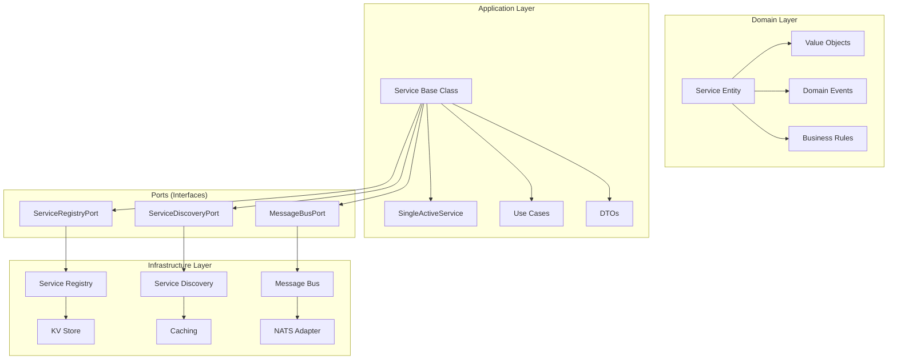
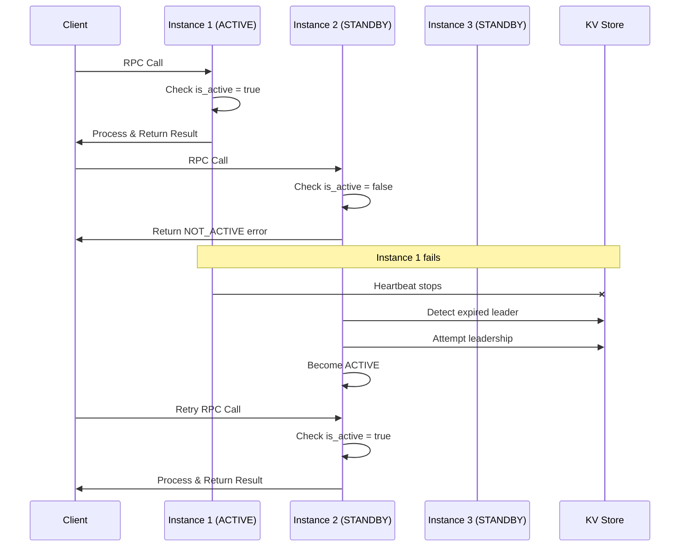
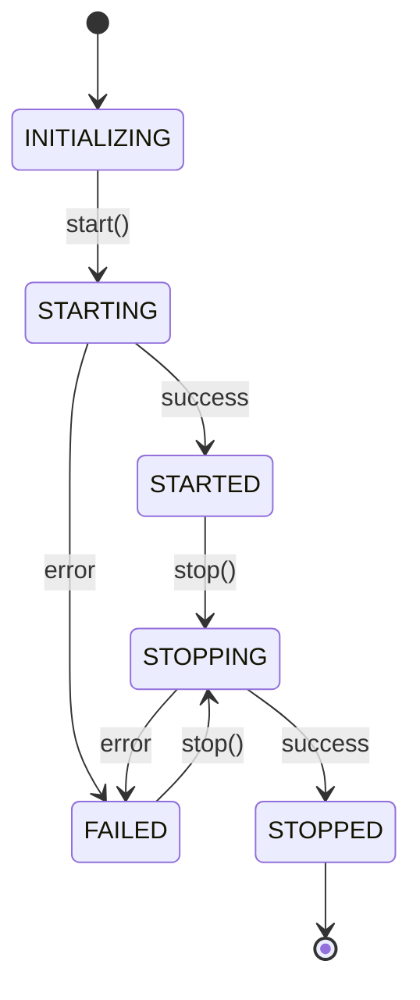
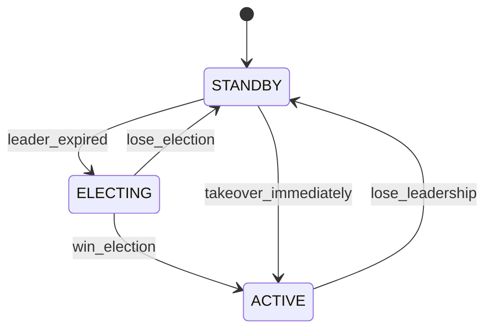
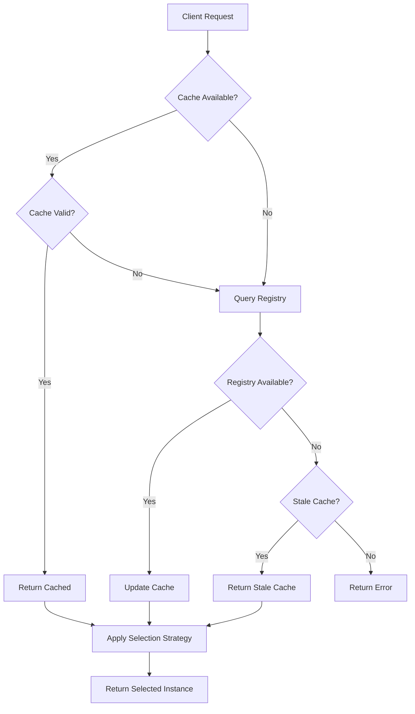

# AegisSDK Service Patterns Documentation

## Table of Contents

1. [Overview](#overview)
2. [Service Architecture](#service-architecture)
3. [Core Service Patterns](#core-service-patterns)
4. [Service Discovery Implementations](#service-discovery-implementations)
5. [Service Registry Types](#service-registry-types)
6. [Specialized Patterns](#specialized-patterns)
7. [Supporting Components](#supporting-components)
8. [Selection Strategies](#selection-strategies)
9. [Use Case Recommendations](#use-case-recommendations)
10. [Configuration Examples](#configuration-examples)
11. [Architecture Diagrams](#architecture-diagrams)

## Overview

The AegisSDK provides a comprehensive service framework following **Domain-Driven Design (DDD)** and **Hexagonal Architecture** principles. The SDK supports multiple service types, each designed for specific architectural patterns and use cases in distributed systems.

### Key Features

- **Type Safety**: Extensive use of Pydantic models and enums for validation
- **Hexagonal Architecture**: Clean separation of domain, application, and infrastructure layers
- **Dependency Injection**: Proper IoC container pattern with factory methods
- **Leader Election**: Built-in sticky active pattern for single-leader scenarios
- **Service Discovery**: Multiple strategies for finding and selecting service instances
- **Health Monitoring**: Comprehensive health checks and heartbeat management
- **Event-Driven**: Full support for events, commands, and RPC patterns

## Service Architecture



## Core Service Patterns

**Important Note:** AegisSDK provides two fundamental service patterns, not three separate service types. The "sticky" behavior is achieved through client-side configuration, not a separate service class.

### 1. Base Service

The foundational service class that implements core functionality for all service types.

#### Features

- **Lifecycle Management**: Proper startup, shutdown, and state transitions
- **Handler Registry**: Thread-safe registration of RPC, event, and command handlers
- **Health Management**: Automatic heartbeat and health monitoring
- **Service Registration**: Automatic registration with service registry
- **Message Routing**: Built-in RPC, event, and command handling

#### Configuration

```python
from aegis_sdk.application.service import ServiceConfig

config = ServiceConfig(
    service_name="my-service",
    instance_id="my-service-abc123",  # Optional, auto-generated if not provided
    version="1.0.0",
    registry_ttl=30.0,               # TTL for service registry
    heartbeat_interval=10.0,         # Heartbeat interval in seconds
    enable_registration=True         # Enable automatic service registration
)
```

#### Example Usage

```python
from aegis_sdk.application.service import Service
from aegis_sdk.domain.models import Event, RPCRequest
from aegis_sdk.domain.enums import SubscriptionMode

class MyService(Service):
    def __init__(self, message_bus, **kwargs):
        super().__init__(
            service_name="my-service",
            message_bus=message_bus,
            **kwargs
        )

    async def on_start(self) -> None:
        """Initialize service handlers during startup."""
        # Register RPC method
        @self.rpc("get_data")
        async def get_data_handler(params: dict) -> dict:
            return {"data": "Hello from service", "params": params}

        # Subscribe to events
        @self.subscribe("orders.*", SubscriptionMode.COMPETE)
        async def handle_order_event(event: Event) -> None:
            self.logger.info(f"Processing order event: {event.event_type}")

        # Register command handler
        @self.command("process_task")
        async def process_task_handler(payload: dict) -> dict:
            return {"status": "processed", "task_id": payload.get("task_id")}

# Usage
service = MyService(message_bus=nats_adapter)
await service.start()
```

#### Key Capabilities

- **RPC Handling**: Synchronous request-response patterns
- **Event Subscription**: Asynchronous event processing with compete/broadcast modes
- **Command Processing**: Async command execution with retry and priority
- **Service Discovery**: Automatic discovery of other services
- **Health Monitoring**: Built-in health checks and status reporting

### 2. SingleActiveService

Specialized service that implements leader election for scenarios requiring exactly one active instance to process exclusive operations. The "sticky" behavior is achieved when clients configure retry policies for NOT_ACTIVE errors.

#### Features

- **Leader Election**: Automatic leader election using distributed consensus
- **Exclusive RPC**: Methods that only execute on the active instance
- **Automatic Failover**: Seamless failover when active instance fails
- **Status Monitoring**: Real-time monitoring of active/standby status
- **Retry Handling**: Built-in retry logic for NOT_ACTIVE responses

#### Configuration

```python
from aegis_sdk.application.single_active_dtos import SingleActiveConfig

config = SingleActiveConfig(
    service_name="order-processor",
    instance_id="order-processor-1",     # Optional
    group_id="main",                     # Sticky active group
    version="1.0.0",
    leader_ttl_seconds=10,               # Leader lease duration
    registry_ttl=30,                     # Service registry TTL
    heartbeat_interval=5,                # Heartbeat frequency
    enable_registration=True
)
```

#### Example Usage

```python
from aegis_sdk.application.single_active_service import SingleActiveService

class OrderProcessor(SingleActiveService):
    def __init__(self, config, **kwargs):
        super().__init__(config=config, **kwargs)

    async def on_start(self) -> None:
        """Register exclusive RPC handlers."""

        # Only the active instance will process this
        @self.exclusive_rpc("process_order")
        async def process_order_handler(params: dict) -> dict:
            order_id = params["order_id"]
            # Critical business logic that must run on exactly one instance
            result = await self.process_critical_order(order_id)
            return {"order_id": order_id, "status": "processed", "result": result}

        # All instances respond to health checks
        @self.rpc("health_check")
        async def health_check_handler(params: dict) -> dict:
            return {
                "instance_id": self.instance_id,
                "is_active": self.is_active,
                "status": "healthy"
            }

    async def process_critical_order(self, order_id: str) -> dict:
        """Business logic that requires single active processing."""
        # Simulate critical processing
        await asyncio.sleep(1)
        return {"processed_at": datetime.now().isoformat()}

# Usage
service = OrderProcessor(
    config=config,
    message_bus=nats_adapter,
    service_registry=registry,
    election_repository=election_repo
)
await service.start()
```

#### Exclusive RPC Response Format

All exclusive RPC methods return a standardized response:

```python
{
    "success": True,
    "result": {
        # Actual method response
    },
    "error": None
}

# When instance is not active:
{
    "success": False,
    "result": None,
    "error": "NOT_ACTIVE",
    "message": "This instance is not active. Instance xyz is in STANDBY mode."
}
```

## Service Discovery Implementations

### 1. BasicServiceDiscovery

Direct service registry queries without caching.

#### Characteristics

- **No Caching**: Always queries service registry directly
- **Simple**: Minimal overhead and complexity
- **Real-time**: Always returns current registry state
- **Higher Latency**: Network call on every discovery

#### Use Cases

- Development environments
- Services with infrequent discovery needs
- When cache consistency is critical

```python
from aegis_sdk.infrastructure.basic_service_discovery import BasicServiceDiscovery

discovery = BasicServiceDiscovery(
    service_registry=kv_registry,
    logger=logger
)

# Discover all healthy instances
instances = await discovery.discover_instances("order-service", only_healthy=True)

# Select instance using strategy
instance = await discovery.select_instance(
    "order-service",
    strategy=SelectionStrategy.ROUND_ROBIN
)
```

### 2. CachedServiceDiscovery

Adds TTL-based caching to any discovery implementation.

#### Features

- **TTL Caching**: Configurable time-to-live for cache entries
- **Stale Fallback**: Returns stale cache on discovery failures
- **Cache Management**: LRU eviction and size limits
- **Metrics Integration**: Cache hit/miss statistics

#### Configuration

```python
from aegis_sdk.infrastructure.cached_service_discovery import (
    CachedServiceDiscovery, CacheConfig
)

cache_config = CacheConfig(
    ttl_seconds=10.0,        # Cache entries valid for 10 seconds
    max_entries=1000,        # Maximum cache entries
    enable_metrics=True      # Track cache statistics
)

discovery = CachedServiceDiscovery(
    inner=BasicServiceDiscovery(kv_registry, logger),
    config=cache_config,
    metrics=metrics_port,
    logger=logger
)
```

#### Use Cases

- High-frequency service discovery
- Production environments with stable service topology
- Reducing load on service registry

### 3. WatchableCachedServiceDiscovery

Real-time cache updates using KV Store watch functionality.

#### Features

- **Real-time Updates**: Cache automatically updated on service changes
- **Watch Reconnection**: Automatic reconnection with backoff
- **Selective Invalidation**: Only affected services are invalidated
- **Fallback Support**: Falls back to TTL cache if watch fails

#### Configuration

```python
from aegis_sdk.infrastructure.watchable_cached_service_discovery import (
    WatchableCachedServiceDiscovery, WatchableCacheConfig, WatchConfig
)

watch_config = WatchConfig(
    enabled=True,                    # Enable watch functionality
    reconnect_delay=5.0,            # Delay between reconnection attempts
    max_reconnect_attempts=10,       # Max reconnection attempts
    prefix_pattern="service-instances"  # KV key prefix to watch
)

cache_config = WatchableCacheConfig(
    ttl_seconds=30.0,
    max_entries=1000,
    enable_metrics=True,
    watch=watch_config
)

discovery = WatchableCachedServiceDiscovery(
    inner=basic_discovery,
    kv_store=kv_store,
    config=cache_config,
    metrics=metrics,
    logger=logger
)
```

#### Use Cases

- High-availability production environments
- Microservices with frequent topology changes
- When cache consistency is critical

## Service Registry Types

### KVServiceRegistry

Key-Value store based service registry with TTL support.

#### Features

- **TTL Support**: Automatic cleanup of expired registrations
- **CRUD Operations**: Full service instance lifecycle management
- **Batch Operations**: Efficient listing of services and instances
- **Error Recovery**: Automatic re-registration on KV failures

#### Implementation Details

```python
from aegis_sdk.infrastructure.kv_service_registry import KVServiceRegistry

registry = KVServiceRegistry(
    kv_store=nats_kv_store,
    logger=logger
)

# Register service instance
instance = ServiceInstance(
    service_name="order-service",
    instance_id="order-service-1",
    version="1.0.0",
    status=ServiceStatus.ACTIVE.value
)
await registry.register(instance, ttl_seconds=30)

# Update heartbeat
await registry.update_heartbeat(instance, ttl_seconds=30)

# List all instances of a service
instances = await registry.list_instances("order-service")
```

#### Key Pattern

Registry keys follow the pattern: `service-instances.{service_name}.{instance_id}`

## Selection Strategies

Service discovery supports multiple instance selection strategies:

### 1. Round Robin

Distributes requests evenly across healthy instances.

```python
from aegis_sdk.ports.service_discovery import SelectionStrategy

instance = await discovery.select_instance(
    "order-service",
    strategy=SelectionStrategy.ROUND_ROBIN
)
```

### 2. Random

Randomly selects from healthy instances.

```python
instance = await discovery.select_instance(
    "order-service",
    strategy=SelectionStrategy.RANDOM
)
```

### 3. Sticky

Prefers a specific instance, falls back to any healthy instance.

```python
instance = await discovery.select_instance(
    "order-service",
    strategy=SelectionStrategy.STICKY,
    preferred_instance_id="order-service-preferred"
)
```

## Specialized Patterns

### Sticky Single-Active Pattern

The Sticky Single-Active pattern combines SingleActiveService (server-side) with retry policies (client-side) to ensure exactly one instance processes exclusive operations while maintaining high availability through automatic failover.

**Key Insight:** This is not a third service type but rather a usage pattern combining:
1. **Server Side:** SingleActiveService with leader election
2. **Client Side:** RetryPolicy or StickyActiveConfig for automatic retries on NOT_ACTIVE errors

#### Architecture



#### Key Components

1. **Election Repository**: Manages leadership state in distributed KV store
2. **Heartbeat Use Case**: Maintains leader lease with TTL
3. **Monitoring Use Case**: Watches for leadership changes
4. **Registration Use Case**: Handles initial leader election

### Client Retry Pattern

Clients automatically handle NOT_ACTIVE responses with exponential backoff:

```python
from aegis_sdk.domain.value_objects import RetryPolicy

retry_policy = RetryPolicy(
    max_attempts=5,
    initial_delay_ms=100,
    max_delay_ms=5000,
    backoff_multiplier=2.0,
    jitter_factor=0.1
)

# Automatic retry on NOT_ACTIVE responses
result = await rpc_use_case.execute(
    RPCCallRequest(
        target_service="order-processor",
        method="process_order",
        params={"order_id": "123"},
        retry_policy=retry_policy
    )
)
```

## Supporting Components

### Health Manager

Manages service health and heartbeat operations:

```python
health_manager = HealthManager(
    service_name="my-service",
    instance_id="my-service-1",
    heartbeat_interval=10.0,
    registry_ttl=30.0,
    message_bus=message_bus,
    registry=service_registry,
    logger=logger,
    on_unhealthy_callback=lambda: service.set_status(ServiceStatus.UNHEALTHY)
)
```

### Lifecycle Manager

Manages service lifecycle state transitions:

```python
lifecycle = LifecycleManager(logger)

# Transition with validation
await lifecycle.transition_to(
    ServiceLifecycleState.STARTED,
    allowed_from=[ServiceLifecycleState.STARTING]
)

# Check operational status
is_operational = lifecycle.is_operational()  # True if STARTED
```

### Handler Registry

Thread-safe handler registration:

```python
registry = HandlerRegistry()

# Register handlers
await registry.register_rpc("get_data", handler_func)
await registry.register_event("orders.*", event_handler, SubscriptionMode.COMPETE)
await registry.register_command("process_task", command_handler)

# Access handlers
rpc_handlers = registry.rpc_handlers
event_handlers = registry.event_handlers
command_handlers = registry.command_handlers
```

## Use Case Recommendations

### When to Use Base Service

- **General microservices** without special coordination requirements
- **Stateless services** that can have multiple active instances
- **API gateways** and proxy services
- **Worker services** processing from queues

### When to Use SingleActiveService

- **Financial transactions** requiring strict ordering
- **State machines** with complex state management  
- **Batch processing** jobs that must not run concurrently
- **Resource coordination** (file processing, external API rate limiting)
- **Singleton services** by design requirement

**Note:** SingleActiveService should always be used with client-side retry policies (achieving the "sticky" pattern). Using SingleActiveService without retries would result in most requests failing with NOT_ACTIVE errors, making it practically useless.

### Service Discovery Strategy Selection

| Pattern | Use Case | Pros | Cons |
|---------|----------|------|------|
| BasicServiceDiscovery | Development, Low-frequency discovery | Simple, Real-time | Higher latency |
| CachedServiceDiscovery | Production, High-frequency discovery | Fast, Reduces registry load | Eventual consistency |
| WatchableCachedServiceDiscovery | Critical production, Real-time updates | Fast + Real-time | Complex, Resource overhead |

### Selection Strategy Guidelines

| Strategy | Use Case | Characteristics |
|----------|----------|-----------------|
| ROUND_ROBIN | Load balancing, Even distribution | Predictable, Fair distribution |
| RANDOM | Simple load balancing | Minimal state, Good for many instances |
| STICKY | Session affinity, Stateful services | Maintains instance preference |

## Configuration Examples

### Complete Service Setup

```python
import asyncio
from aegis_sdk.application.single_active_service import SingleActiveService
from aegis_sdk.application.single_active_dtos import SingleActiveConfig
from aegis_sdk.infrastructure.nats_adapter import NATSAdapter
from aegis_sdk.infrastructure.nats_kv_store import NATSKVStore
from aegis_sdk.infrastructure.kv_service_registry import KVServiceRegistry
from aegis_sdk.infrastructure.nats_kv_election_repository import NatsKvElectionRepository

async def setup_service():
    # Infrastructure setup
    nats = NATSAdapter()
    await nats.connect("nats://localhost:4222")

    # KV Stores
    registry_kv = NATSKVStore(nats)
    await registry_kv.connect("service_registry")

    election_kv = NATSKVStore(nats)
    await election_kv.connect("sticky_active")

    # Ports
    service_registry = KVServiceRegistry(registry_kv)
    election_repo = NatsKvElectionRepository(election_kv)

    # Service configuration
    config = SingleActiveConfig(
        service_name="order-processor",
        group_id="production",
        version="1.0.0",
        leader_ttl_seconds=10,
        registry_ttl=30,
        heartbeat_interval=5
    )

    # Create service
    service = OrderProcessorService(
        config=config,
        message_bus=nats,
        service_registry=service_registry,
        election_repository=election_repo
    )

    await service.start()
    return service
```

### Client Configuration

```python
from aegis_sdk.infrastructure.cached_service_discovery import CachedServiceDiscovery
from aegis_sdk.infrastructure.basic_service_discovery import BasicServiceDiscovery

async def setup_client():
    # Discovery with caching
    basic_discovery = BasicServiceDiscovery(service_registry)

    cached_discovery = CachedServiceDiscovery(
        inner=basic_discovery,
        config=CacheConfig(ttl_seconds=15.0, max_entries=500),
        metrics=metrics_port
    )

    # Client service
    client = Service(
        service_name="api-client",
        message_bus=nats_adapter,
        service_discovery=cached_discovery
    )

    await client.start()
    return client
```

## Architecture Diagrams

### Service Lifecycle



### Sticky Active Election



### Service Discovery Flow



This comprehensive documentation provides developers with everything needed to understand, implement, and operate services using the AegisSDK. The combination of clear examples, architectural patterns, and practical guidance ensures successful adoption of the framework's capabilities.
