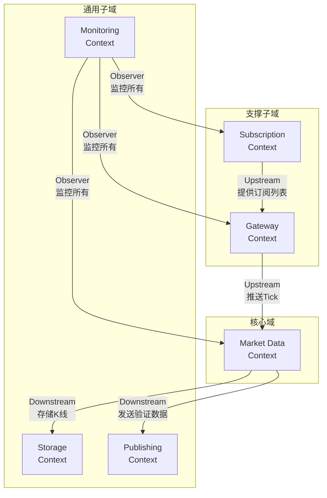

# 行情服务 DDD 设计 - Phase 2: 战略设计

## 子域识别与分类

基于Phase 1的领域探索，我们识别出以下子域：

### 核心域 (Core Domain)
**市场数据处理域 (Market Data Processing)**
- **价值主张**: 实时、准确的市场数据是交易系统的生命线
- **差异化能力**: 低延迟数据验证、智能异常检测、高效数据聚合
- **关键功能**: Tick验证、异常价格检测、分钟K线生成、数据质量监控
- **为什么是核心**: 数据质量直接影响交易决策，是竞争优势的基础

### 支撑子域 (Supporting Subdomain)
**网关连接管理域 (Gateway Connection Management)**
- **职责**: 管理与交易所的连接生命周期
- **功能**: 连接建立、认证、重连机制、心跳维护
- **为什么是支撑**: 必要但非差异化，遵循交易所标准协议

**合约订阅管理域 (Contract Subscription Management)**
- **职责**: 管理合约列表和订阅状态
- **功能**: 合约查询、订阅管理、订阅状态跟踪
- **为什么是支撑**: 标准化的订阅流程，无特殊业务逻辑

### 通用子域 (Generic Subdomain)
**数据存储域 (Data Persistence)**
- **职责**: 持久化市场数据到ClickHouse
- **功能**: 批量写入、重试机制、数据压缩
- **为什么是通用**: 可使用标准时序数据库方案

**消息发布域 (Message Publishing)**
- **职责**: 通过PubSub发布市场事件
- **功能**: 消息序列化、发布确认、订阅者管理
- **为什么是通用**: 标准消息中间件功能

**监控告警域 (Monitoring & Alerting)**
- **职责**: 系统健康监控和告警
- **功能**: 指标采集、阈值检测、告警通知
- **为什么是通用**: 可使用现成的监控方案（Prometheus/Grafana）

## 限界上下文定义

### 1. Market Data Context（市场数据上下文）- 核心
**领域模型**:
- `MarketTick`: 市场价格快照
- `MarketBar`: 时间聚合K线
- `DataValidator`: 数据验证器
- `AnomalyDetector`: 异常检测器
- `BarAggregator`: K线聚合器

**职责边界**:
- 接收原始Tick数据
- 执行数据质量验证
- 检测价格异常
- 生成分钟K线
- 发布验证后的数据

**统一语言**:
- Tick: 交易所推送的原始价格数据
- Validation: 数据完整性和合理性检查
- Anomaly: 超出正常范围的价格波动
- Bar: 固定时间窗口的OHLCV数据

### 2. Gateway Context（网关上下文）- 支撑
**领域模型**:
- `Gateway`: 网关抽象
- `CtpGateway`: CTP期货网关
- `SoptGateway`: SOPT期权网关
- `ConnectionManager`: 连接管理器
- `AuthenticationService`: 认证服务

**职责边界**:
- 管理网关生命周期
- 处理连接和认证
- 实现自动重连
- 适配不同协议

**统一语言**:
- Gateway: 与交易所通信的适配器
- Connection: 物理网络连接
- Authentication: 身份验证过程
- Heartbeat: 连接保活信号

### 3. Subscription Context（订阅上下文）- 支撑
**领域模型**:
- `Instrument`: 交易合约
- `SubscriptionList`: 订阅列表
- `SubscriptionManager`: 订阅管理器

**职责边界**:
- 维护合约列表
- 管理订阅状态
- 处理订阅请求

**统一语言**:
- Instrument: 可交易的金融工具
- Subscribe: 请求接收特定合约的行情
- Contract List: 可订阅的合约清单

### 4. Storage Context（存储上下文）- 通用
**领域模型**:
- `TimeSeriesWriter`: 时序数据写入器
- `RetryPolicy`: 重试策略
- `BatchProcessor`: 批处理器

**职责边界**:
- 批量存储K线数据
- 处理存储失败和重试
- 优化写入性能

### 5. Publishing Context（发布上下文）- 通用
**领域模型**:
- `EventPublisher`: 事件发布器
- `MessageSerializer`: 消息序列化器

**职责边界**:
- 序列化市场数据
- 发布到消息队列
- 确保消息投递

### 6. Monitoring Context（监控上下文）- 通用
**领域模型**:
- `MetricCollector`: 指标收集器
- `AlertManager`: 告警管理器
- `HealthChecker`: 健康检查器

**职责边界**:
- 收集系统指标
- 检测异常状态
- 发送告警通知

## 上下文映射



## 上下文关系详解

### 1. Gateway → Market Data (Customer-Supplier)
- **关系类型**: Customer-Supplier，Gateway是Supplier
- **接口定义**:
  ```python
  interface TickDataProvider:
      def on_tick(tick: RawTickData) -> None
  ```
- **数据流向**: Gateway推送原始Tick到Market Data
- **协调方式**: Market Data定义数据需求，Gateway满足需求

### 2. Subscription → Gateway (Customer-Supplier)
- **关系类型**: Customer-Supplier，Subscription是Supplier
- **接口定义**:
  ```python
  interface SubscriptionProvider:
      def get_subscription_list() -> List[Instrument]
      def update_subscription(instruments: List[Instrument]) -> None
  ```
- **数据流向**: Subscription提供订阅列表给Gateway
- **协调方式**: Gateway依赖Subscription提供的合约列表

### 3. Market Data → Publishing (Conformist)
- **关系类型**: Conformist，Market Data遵循Publishing的接口
- **接口定义**:
  ```python
  interface MessagePublisher:
      def publish(topic: str, message: bytes) -> None
  ```
- **数据流向**: Market Data发送序列化的Tick/Bar到Publishing
- **协调方式**: Market Data适配Publishing的消息格式

### 4. Market Data → Storage (Conformist)
- **关系类型**: Conformist，Market Data遵循Storage的接口
- **接口定义**:
  ```python
  interface TimeSeriesStorage:
      def write_bars(bars: List[BarData]) -> None
  ```
- **数据流向**: Market Data批量写入K线到Storage
- **协调方式**: Market Data适配Storage的数据格式

### 5. Monitoring → All Contexts (Observer Pattern)
- **关系类型**: Separate Ways with Event Monitoring
- **接口定义**:
  ```python
  interface Monitorable:
      def export_metrics() -> Dict[str, float]
      def health_check() -> HealthStatus
  ```
- **数据流向**: 各Context暴露指标，Monitoring收集
- **协调方式**: 松耦合，通过标准指标接口

## 防腐层设计

### Gateway Context → Market Data Context
需要防腐层(ACL)来转换不同交易所的数据格式：

```python
class GatewayDataAdapter:
    """防腐层：转换交易所特定格式到统一域模型"""

    def adapt_ctp_tick(self, ctp_data: CtpMarketData) -> MarketTick:
        # CTP特定字段映射到标准MarketTick
        pass

    def adapt_sopt_tick(self, sopt_data: SoptMarketData) -> MarketTick:
        # SOPT特定字段映射到标准MarketTick
        pass
```

## 关键设计决策

### 1. 为什么将数据处理作为核心域？
- **业务价值**: 数据质量直接影响交易决策和风险控制
- **竞争优势**: 低延迟、高质量的数据处理是差异化能力
- **复杂度**: 涉及复杂的验证规则、异常检测算法

### 2. 为什么Gateway和Subscription分离？
- **变化频率不同**: Gateway关注连接稳定性，Subscription关注业务配置
- **职责单一**: Gateway专注协议适配，Subscription专注订阅管理
- **可测试性**: 分离后更容易进行单元测试

### 3. 为什么采用防腐层？
- **隔离变化**: 交易所协议可能变化，不应影响核心域
- **保持纯净**: 核心域使用统一的业务语言，不受外部污染
- **支持多源**: 便于接入新的数据源而不修改核心逻辑

### 4. 为什么Monitoring独立？
- **横切关注点**: 监控是所有上下文都需要的
- **技术特性**: 监控更多是技术需求而非业务需求
- **可替换性**: 便于更换监控方案而不影响业务逻辑

## 集成点识别

### 事件集成点
- Gateway → Market Data: `RawTickReceived`
- Market Data → Publishing: `ValidatedTickReady`, `BarGenerated`
- Market Data → Storage: `BarsReadyToStore`
- All → Monitoring: `MetricsExported`, `AlertTriggered`

### 同步集成点
- Subscription ← → Gateway: 合约列表查询和更新
- Market Data → Storage: 批量写入K线（可异步）

---

## Phase 2 完成总结

### 战略设计成果
- **6个限界上下文** - 职责明确，边界清晰
- **1个核心域** - 聚焦数据处理价值
- **2个支撑子域** - 必要但非差异化
- **3个通用子域** - 可用标准方案
- **5种上下文关系** - 明确集成模式
- **防腐层设计** - 保护核心域纯净

### 下一步
Phase 2 战略设计完成。请确认后，选择一个核心限界上下文（建议选择 Market Data Context）进入 Phase 3：战术设计（Tactical Design）。
