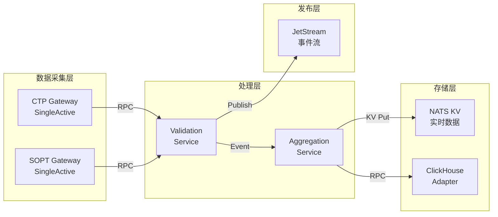

# 行情服务 DDD 设计 - Phase 4: 架构与支撑模式

## 架构理念

基于AegisSDK构建的分布式行情服务，利用NATS的高性能消息传递和KV存储能力，实现毫秒级延迟的实时数据处理。

## 架构选择

### 基于AegisSDK的六边形架构

利用SDK已实现的DDD分层和端口适配器模式：

```yaml
架构层次映射:
  Domain Layer:
    - 行情服务的业务逻辑（继承SDK的domain层）
    - MarketDataStream、MarketBar等聚合
    - 价格验证、异常检测等领域服务

  Application Layer:
    - 继承自aegis_sdk.application.Service
    - 实现行情特定的use cases
    - 协调领域对象完成业务流程

  Infrastructure Layer:
    - 复用SDK的NATS适配器
    - 扩展KV Store用于K线存储
    - 实现ClickHouse适配器

  Ports Layer:
    - 复用SDK的MessageBusPort
    - 扩展Repository接口
    - 定义行情特定的端口
```

### 服务模式选择

| 服务类型 | SDK基类 | 适用场景 | 实例配置 |
|---------|---------|---------|---------|
| **网关服务** | SingleActiveService | CTP/SOPT连接管理 | 单活跃，自动故障转移 |
| **验证服务** | Service | Tick数据验证 | 多实例负载均衡 |
| **聚合服务** | Service | K线生成 | 按合约分片，多实例 |
| **存储服务** | SingleActiveService | ClickHouse写入 | 单活跃，避免重复写入 |

## 通信模式设计

### 基于NATS的数据流



### 消息模式应用

| 场景 | 模式 | SDK实现 | 特点 |
|------|------|---------|------|
| **Tick验证请求** | RPC | RPCRequest/Response | 同步，有超时控制 |
| **Tick数据广播** | Event | Event + JetStream | 异步，持久化，可重放 |
| **K线存储** | Command | Command模式 | 可靠投递，自动重试 |
| **服务发现** | KV Watch | ServiceDiscovery | 实时更新，自动故障转移 |

## 高可用设计

### 单活跃模式应用

```yaml
网关服务 (SingleActiveService):
  选举策略:
    - 使用NATS KV进行领导者选举
    - TTL: 2秒（心跳间隔）
    - 故障转移: <2秒完成

  配置示例:
    failover_policy: FailoverPolicy.aggressive()
    heartbeat_interval: 1.0
    election_timeout: 2.0

验证服务 (Service):
  负载均衡:
    - NATS队列组自动负载均衡
    - 无需选举，所有实例平等
    - 水平扩展: 按需增加实例

存储服务 (SingleActiveService):
  一致性保证:
    - 单活跃避免重复写入
    - 批量缓冲提高效率
    - 故障时自动切换备用实例
```

### 故障转移机制

| 组件 | 检测机制 | 转移时间 | 恢复策略 |
|------|---------|---------|---------|
| **网关** | 心跳超时(2s) | <2s | 备用实例自动接管 |
| **验证** | NATS自动检测 | 即时 | 请求自动路由到健康实例 |
| **存储** | KV TTL过期 | <5s | 新leader接管缓冲区 |

## 数据存储架构

### 多层存储策略

```yaml
L1 - 进程内缓存:
  用途: 最新Tick缓存
  实现: LRU缓存，100ms过期
  容量: 每合约最新10个Tick

L2 - NATS KV Store:
  用途: 实时数据和最近K线
  实现:
    - aegis_sdk.infrastructure.nats_kv_store
    - TTL: 1小时（热数据）
  数据结构:
    tick:{symbol}:{exchange} → 最新Tick
    bar:1m:{symbol}:{date} → 当日1分钟K线

L3 - ClickHouse:
  用途: 历史数据持久化
  实现: 批量异步写入
  分区: 按日期分区，按合约分片
```

### Repository实现

```yaml
MarketDataRepository:
  接口层: ports.repository.MarketDataRepository
  实现层:
    - KVMarketDataRepository (NATS KV)
    - CHMarketDataRepository (ClickHouse)

  协调策略:
    - 写入: 同时写KV和CH（异步）
    - 查询: 先查KV，miss则查CH
    - 缓存: KV作为CH的缓存层
```

## 监控与可观测性

### 基于SDK的监控

```yaml
内置指标 (InMemoryMetrics):
  - RPC延迟: P50/P95/P99
  - 消息吞吐量: msg/sec
  - 错误率: errors/total
  - 队列深度: 待处理消息数

扩展指标:
  - Tick处理延迟
  - K线生成延迟
  - 数据质量分数
  - 存储写入速度

健康检查:
  endpoint: /health
  包含:
    - 服务状态
    - 连接状态
    - 性能指标
    - 依赖健康度
```

### 日志策略

```yaml
结构化日志:
  使用: LogContext (SDK提供)
  字段:
    - service_name
    - instance_id
    - operation
    - trace_id
    - correlation_id

日志级别:
  - ERROR: 数据丢失、服务不可用
  - WARN: 数据质量问题、性能降级
  - INFO: 关键业务事件
  - DEBUG: 详细处理流程
```

## CQRS实现方案

### 基于AegisSDK的CQRS

```yaml
写入端 (Command):
  服务: MarketDataProcessor (SingleActiveService)
  流程:
    1. 接收验证后的Tick (RPC)
    2. 更新领域模型
    3. 发布领域事件 (JetStream)
    4. 异步持久化

读取端 (Query):
  服务: MarketDataQuery (Service)
  数据源:
    - NATS KV (实时数据)
    - ClickHouse (历史数据)
  投影:
    - 最新行情视图
    - K线聚合视图
    - 统计分析视图

同步机制:
  - 事件驱动更新
  - 最终一致性
  - 读模型延迟 <100ms
```

## 部署架构

### 容器化部署

```yaml
服务拆分:
  market-gateway:
    image: aegis/market-gateway:latest
    replicas: 2 (主备)
    pattern: SingleActiveService

  market-validator:
    image: aegis/market-validator:latest
    replicas: 3-5 (按负载)
    pattern: Service

  market-aggregator:
    image: aegis/market-aggregator:latest
    replicas: 按合约数量分片
    pattern: Service

  market-storage:
    image: aegis/market-storage:latest
    replicas: 2 (主备)
    pattern: SingleActiveService

依赖服务:
  nats-cluster:
    mode: cluster (3节点)
    jetstream: enabled
    kv_store: enabled

  clickhouse:
    mode: cluster
    replicas: 2
    shards: 按数据量
```

### Kubernetes配置

```yaml
资源配置:
  market-gateway:
    cpu: 2核
    memory: 4Gi
    网络: host模式（低延迟）

  market-validator:
    cpu: 4核
    memory: 8Gi
    自动扩缩: HPA (CPU >70%)

  市场聚合器:
    cpu: 2核
    memory: 4Gi
    亲和性: 按合约分布

存储:
  - PVC for ClickHouse
  - EmptyDir for临时缓存
```

## 性能优化

### 延迟优化

| 优化点 | 策略 | 预期效果 |
|--------|------|---------|
| **消息序列化** | MessagePack (SDK内置) | 减少50%序列化开销 |
| **连接池** | SDK connection pool | 避免连接开销 |
| **批处理** | 聚合100ms内的Tick | 减少网络往返 |
| **零拷贝** | 直接内存访问 | 减少内存拷贝 |

### 吞吐量优化

```yaml
并发策略:
  - 协程处理I/O (asyncio)
  - 多进程处理CPU密集任务
  - NATS自动负载均衡

分片策略:
  - 按合约分片处理
  - 独立的消息队列
  - 并行K线生成

缓存策略:
  - 热点数据进程内缓存
  - KV Store作为二级缓存
  - 预计算常用指标
```

## 实施计划

### 第一阶段：基础集成（1周）
```yaml
目标: 集成AegisSDK，实现基础服务
任务:
  - 创建网关服务（继承SingleActiveService）
  - 实现Tick验证服务
  - 集成NATS JetStream
  - 基础健康检查
```

### 第二阶段：核心功能（1周）
```yaml
目标: 实现核心业务逻辑
任务:
  - 实现领域模型
  - K线聚合服务
  - KV Store集成
  - 事件发布机制
```

### 第三阶段：存储优化（1周）
```yaml
目标: 完善存储层
任务:
  - ClickHouse适配器
  - 批量写入优化
  - 查询服务实现
  - 缓存策略优化
```

### 第四阶段：生产就绪（1周）
```yaml
目标: 生产环境准备
任务:
  - 容器化部署
  - K8s配置
  - 监控完善
  - 性能测试
```

## 风险与缓解

| 风险 | 影响 | 缓解措施 |
|------|------|---------|
| **NATS单点** | 服务不可用 | 3节点集群，自动故障转移 |
| **KV Store容量** | 性能下降 | 设置TTL，定期清理 |
| **网络分区** | 数据不一致 | SDK内置重试和补偿机制 |
| **延迟累积** | 数据延迟 | 监控队列深度，动态扩容 |

---

## Phase 4 完成总结

### 架构决策

- **基础框架**: AegisSDK (已有的DDD实现)
- **消息传递**: NATS JetStream + KV Store
- **服务模式**: SingleActiveService (关键服务) + Service (无状态服务)
- **存储方案**: 三层存储架构 (内存/KV/ClickHouse)
- **高可用**: 自动故障转移，<2秒恢复

### 技术优势

1. **复用成熟框架**: 基于AegisSDK，避免重复造轮子
2. **统一技术栈**: NATS作为唯一消息中间件
3. **内置高可用**: SDK提供的单活跃模式和故障转移
4. **简化运维**: 减少技术组件，降低复杂度
5. **性能优化**: MessagePack序列化，连接池复用

### 实施建议

采用**增量交付**策略，每周交付可工作的版本，优先实现核心功能，逐步完善周边能力。充分利用SDK提供的能力，专注于业务逻辑实现。

**Phase 4 架构设计完成，与现有技术栈完全兼容。**
