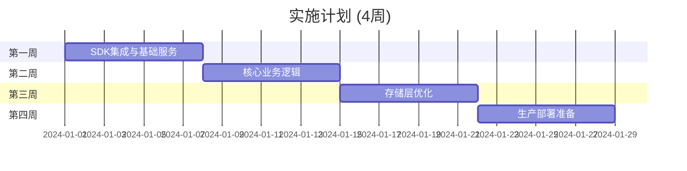

# 行情服务 DDD 设计文档

## 项目概述

本文档集包含了行情服务完整的领域驱动设计（DDD），从业务需求分析到架构实施建议的全过程。

## 设计目标

构建一个**高性能、高可用、可扩展**的实时行情服务系统：
- 支持多数据源接入（CTP期货、SOPT期权）
- 毫秒级数据处理延迟
- 每秒处理数万笔Tick数据
- 完整的数据质量保证机制

## 文档结构

### [架构全景图](./architecture-overview.md) 🆕
**完整架构蓝图** - 综合四个阶段的设计成果
- 从业务到技术的完整映射
- 服务拓扑和部署架构
- 实施路径和依赖关系
- 架构决策记录

### [Phase 1: 领域探索](./01-domain-exploration.md)
**Event Storming** - 识别业务事件和流程
- 识别了3个核心Actor
- 定义了46个领域事件
- 明确了16个业务命令
- 制定了8个业务不变量

### [Phase 2: 战略设计](./02-strategic-design.md)
**Strategic Design** - 划分限界上下文
- 1个核心域：市场数据处理
- 2个支撑子域：网关连接、合约订阅
- 3个通用子域：存储、发布、监控
- 5种上下文关系模式

### [Phase 3: 战术设计](./03-tactical-design.md)
**Tactical Design** - 设计聚合和实体
- 3个核心聚合：MarketDataStream、MarketBar、DataQualityMonitor
- 2个实体 + 10个值对象
- 3个Repository接口
- 3个领域服务

### [Phase 4: 架构模式](./04-architecture-patterns.md)
**Architecture Patterns** - 选择架构和模式
- 基于AegisSDK的六边形架构
- SingleActiveService高可用模式
- NATS JetStream事件驱动
- 三层存储架构

## 核心设计决策

| 决策领域 | 选择 | 理由 |
|---------|------|------|
| **架构风格** | 六边形 + 事件驱动 | 隔离业务逻辑，支持高并发 |
| **聚合设计** | 小聚合原则 | 降低并发冲突，提高性能 |
| **数据一致性** | 最终一致性 | 平衡性能和一致性需求 |
| **读写模式** | CQRS | 优化查询性能，支持复杂查询 |
| **事件存储** | 混合方案 | 部分ES，避免过度设计 |

## 技术栈

```yaml
基础框架: AegisSDK + vnpy 4.1.0
消息传递: NATS JetStream + KV Store
时序数据库: ClickHouse
缓存: NATS KV Store + 进程内缓存
服务框架: AegisSDK (Service/SingleActiveService)
监控: SDK内置监控 + FastAPI管理接口
容器化: Docker + Kubernetes
```

## 实施路线



## 性能指标

| 指标 | 目标值 | 测量方法 |
|------|--------|---------|
| **Tick处理延迟** | < 1ms | P99延迟 |
| **吞吐量** | > 50,000 TPS | 压力测试 |
| **数据准确率** | > 99.99% | 质量监控 |
| **系统可用性** | > 99.95% | SLA监控 |

## 团队职责

| 角色 | 职责 | 所需技能 |
|------|------|---------|
| **架构师** | 整体设计、技术决策 | DDD、分布式系统 |
| **领域专家** | 业务规则、验证逻辑 | 金融市场、交易系统 |
| **开发工程师** | 功能实现、测试 | Python、vnpy、Redis |
| **DevOps** | 部署、监控、运维 | K8s、监控工具 |

## 风险管理

| 风险类型 | 缓解措施 |
|---------|---------|
| **技术风险** | 原型验证、性能测试 |
| **业务风险** | 领域专家参与、持续验证 |
| **运维风险** | 自动化部署、完善监控 |
| **团队风险** | 知识分享、文档完善 |

## 后续演进

1. **短期**（1个月）
   - 完成基于AegisSDK的核心服务
   - 实现单活跃模式和故障转移
   - 集成NATS KV Store缓存

2. **中期**（3个月）
   - 扩展更多交易所网关
   - 优化KV Store使用策略
   - 完善监控管理界面

3. **长期**（6个月）
   - 多集群部署支持
   - 高级分析功能集成
   - 与其他AegisTrader服务深度整合

## 参考资料

- [Domain-Driven Design by Eric Evans](https://www.domainlanguage.com/ddd/)
- [Implementing Domain-Driven Design by Vaughn Vernon](https://www.informit.com/store/implementing-domain-driven-design-9780321834577)
- [vnpy Documentation](https://www.vnpy.com/docs/cn/index.html)
- [Event Storming](https://www.eventstorming.com/)

---

*本设计文档基于DDD方法论，结合实际业务需求，为行情服务提供完整的设计指导。*

*生成时间: 2025-08-08*
*版本: 1.0*
