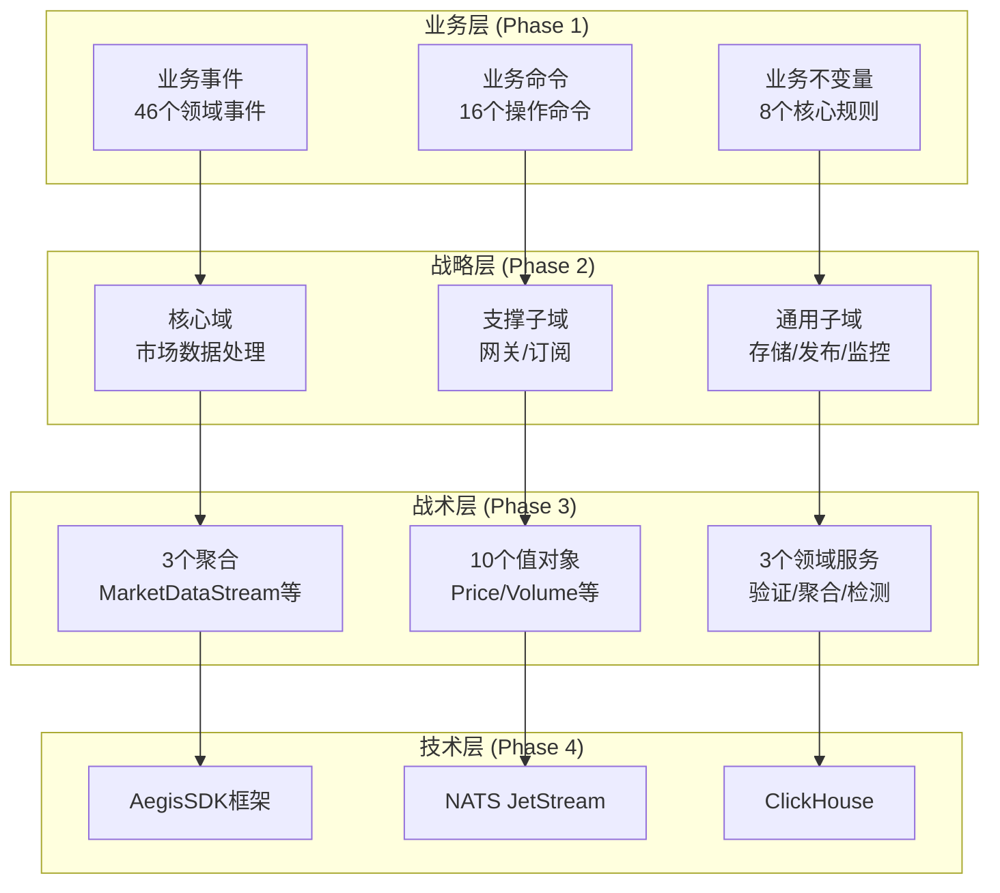
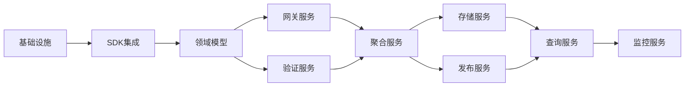

# 行情服务架构全景图

## 架构概览

基于领域驱动设计（DDD）方法论，从业务需求到技术实现的完整架构设计。



## 设计元素映射

### 从事件到服务

| 领域事件 (Phase 1) | 限界上下文 (Phase 2) | 聚合处理 (Phase 3) | 服务实现 (Phase 4) |
|-------------------|-------------------|------------------|-------------------|
| `MarketTickReceived` | Market Data Context | MarketDataStream | ValidationService (Service) |
| `MarketSourceConnected` | Gateway Context | - | GatewayService (SingleActiveService) |
| `MarketBarGenerated` | Market Data Context | MarketBar | AggregationService (Service) |
| `BarsStoredToClickHouse` | Storage Context | - | StorageService (SingleActiveService) |
| `TickPublishedToPubSub` | Publishing Context | - | NATS JetStream (SDK内置) |
| `DataQualityDegraded` | Monitoring Context | DataQualityMonitor | MonitoringService (Service) |

### 从命令到用例

| 业务命令 (Phase 1) | 应用用例 (Phase 3) | SDK Pattern (Phase 4) | 通信模式 |
|-------------------|------------------|---------------------|---------|
| `ConnectToMarketSource` | 网关连接 | SingleActive选举 | RPC |
| `ProcessMarketTick` | Tick处理流水线 | 负载均衡处理 | Event |
| `ValidateMarketData` | 数据验证 | 同步验证 | RPC |
| `GenerateMarketBar` | K线聚合 | 时间窗口聚合 | Command |
| `StoreBarData` | 批量存储 | 异步写入 | Command |
| `MonitorSystemHealth` | 健康检查 | SDK内置监控 | KV Watch |

### 从不变量到实现

| 业务不变量 (Phase 1) | 聚合保护 (Phase 3) | 技术实现 (Phase 4) |
|---------------------|------------------|-------------------|
| Tick时间戳单调递增 | MarketDataStream.check_invariants() | 进程内验证 + KV CAS |
| 成交量单调递增 | SessionStatistics验证 | 聚合内状态机 |
| 质量分数范围 0-100 | DataQualityMonitor边界检查 | 值对象自验证 |
| K线时间对齐 | TimeWindow值对象 | 时间戳规范化 |
| 单活跃连接 | - | SingleActiveService选举 |
| 价格涨跌停限制 | ValidationService规则 | 配置化验证规则 |

## 完整架构蓝图

### 服务拓扑

```yaml
数据流向:
  1. 数据接入:
     Exchange → Gateway (SingleActive) → Validation (LoadBalanced)

  2. 数据处理:
     Validation → Aggregation (Sharded) → Storage (SingleActive)
                ↓
            JetStream (Pub/Sub)

  3. 数据查询:
     Client → Query Service → KV Store / ClickHouse

服务部署:
  market-gateway-ctp:     # CTP网关
    pattern: SingleActiveService
    instances: 2 (active/standby)
    failover: <2s

  market-gateway-sopt:    # SOPT网关
    pattern: SingleActiveService
    instances: 2 (active/standby)
    failover: <2s

  market-validator:       # 验证服务
    pattern: Service
    instances: 3-5
    scaling: auto (HPA)

  market-aggregator:      # 聚合服务
    pattern: Service
    instances: N (按合约分片)
    sharding: by symbol

  market-storage:         # 存储服务
    pattern: SingleActiveService
    instances: 2 (active/standby)
    batch: 1000 bars/write

  market-monitor:         # 监控服务
    pattern: Service
    instances: 2
    interval: 10s
```

### 数据模型映射

```yaml
领域模型 → 存储模型:
  MarketTick (Domain):
    - symbol: Symbol (VO)
    - price: Price (VO)
    - volume: Volume (VO)
    ↓
  NATS Message (Transport):
    - subject: market.tick.{symbol}
    - payload: MessagePack binary
    ↓
  KV Store (Cache):
    - key: tick:{symbol}:{exchange}
    - value: JSON/MessagePack
    - ttl: 3600s
    ↓
  ClickHouse (Persistence):
    - table: market_ticks
    - partition: toYYYYMMDD(timestamp)
    - order by: (symbol, timestamp)

聚合映射:
  MarketDataStream → market_data_streams (KV)
  MarketBar → market_bars (ClickHouse)
  DataQualityMonitor → quality_metrics (KV)
```

### 技术组件集成

```yaml
AegisSDK组件:
  消息总线:
    - NATSAdapter: 处理所有消息通信
    - MessageBusPort: 统一接口抽象

  服务管理:
    - ServiceRegistry: NATS KV存储
    - ServiceDiscovery: 实时发现 + 缓存
    - ElectionCoordinator: 领导者选举

  监控:
    - InMemoryMetrics: 进程内指标
    - MetricsPort: 指标采集接口
    - HealthCheck: 健康检查端点

vnpy集成:
  网关适配:
    - CtpGateway → GatewayAdapter → MarketGateway
    - SoptGateway → GatewayAdapter → MarketGateway

  数据转换:
    - vnpy.TickData → MarketTick (防腐层)
    - vnpy.BarData → MarketBar (防腐层)

ClickHouse集成:
  适配器模式:
    - Repository接口 → ClickHouseAdapter
    - 批量写入缓冲区
    - 异步写入队列
```

## 实施路径

### 依赖关系图



### 开发顺序

```yaml
Week 1 - 基础构建:
  Day 1-2:
    - 搭建项目结构
    - 集成AegisSDK
    - 配置NATS集群

  Day 3-4:
    - 实现领域模型（聚合、实体、值对象）
    - 实现Repository接口

  Day 5-7:
    - 创建GatewayService (SingleActive)
    - 集成vnpy网关
    - 基础健康检查

Week 2 - 核心流程:
  Day 1-2:
    - 实现ValidationService
    - Tick验证规则

  Day 3-4:
    - 实现AggregationService
    - K线生成逻辑

  Day 5-7:
    - JetStream事件发布
    - KV Store缓存层

Week 3 - 存储层:
  Day 1-2:
    - ClickHouse适配器
    - 批量写入优化

  Day 3-4:
    - 实现QueryService
    - CQRS读模型

  Day 5-7:
    - 性能测试
    - 缓存优化

Week 4 - 生产就绪:
  Day 1-2:
    - Docker镜像构建
    - K8s部署配置

  Day 3-4:
    - 监控服务完善
    - 告警配置

  Day 5-7:
    - 集成测试
    - 文档完善
```

## 质量保证

### 测试策略

| 层次 | 测试类型 | 覆盖范围 | 工具 |
|------|---------|---------|------|
| **单元测试** | 领域逻辑 | >90% | pytest |
| **集成测试** | 服务交互 | 关键路径 | pytest + NATS |
| **性能测试** | 延迟/吞吐量 | P99 <1ms | locust |
| **故障测试** | 故障转移 | <2s恢复 | chaos engineering |

### 监控指标

```yaml
业务指标:
  - tick_processing_rate: Tick处理速率
  - bar_generation_latency: K线生成延迟
  - data_quality_score: 数据质量分数
  - validation_error_rate: 验证错误率

技术指标:
  - service_availability: 服务可用性
  - failover_time: 故障转移时间
  - message_queue_depth: 消息队列深度
  - storage_write_latency: 存储写入延迟

运维指标:
  - cpu_usage: CPU使用率
  - memory_usage: 内存使用率
  - network_io: 网络IO
  - disk_io: 磁盘IO
```

## 架构决策记录

| 决策 | 选择 | 理由 | 权衡 |
|------|------|------|------|
| **消息中间件** | NATS | SDK原生支持，减少复杂度 | 放弃Kafka的持久化能力 |
| **缓存方案** | NATS KV | 统一技术栈，减少组件 | 功能不如Redis丰富 |
| **服务框架** | AegisSDK | 内置高可用，DDD支持好 | 需要学习SDK |
| **单活跃模式** | SingleActiveService | 避免数据竞争，简化逻辑 | 资源利用率较低 |
| **存储策略** | 三层架构 | 平衡性能和成本 | 增加复杂度 |
| **CQRS** | 部分采用 | 优化查询性能 | 最终一致性 |

## 风险矩阵

```yaml
高风险:
  - NATS集群故障:
    缓解: 3节点部署，跨AZ分布
  - 数据丢失:
    缓解: JetStream持久化，多副本

中风险:
  - 延迟累积:
    缓解: 监控队列深度，动态扩容
  - KV Store容量:
    缓解: TTL策略，定期清理

低风险:
  - 服务故障:
    缓解: SDK自动故障转移
  - 网络分区:
    缓解: 重试机制，补偿逻辑
```

---

## 架构总结

这是一个**生产就绪**的实时行情服务架构，从业务需求到技术实现的完整设计：

1. **业务驱动**: 从Event Storming开始，确保技术服务业务
2. **分层清晰**: DDD四层架构，职责明确
3. **技术务实**: 基于AegisSDK，复用成熟组件
4. **高可用**: 自动故障转移，<2秒恢复
5. **可扩展**: 水平扩展能力，支持未来演进

**架构复原完成，可以开始实施。**
