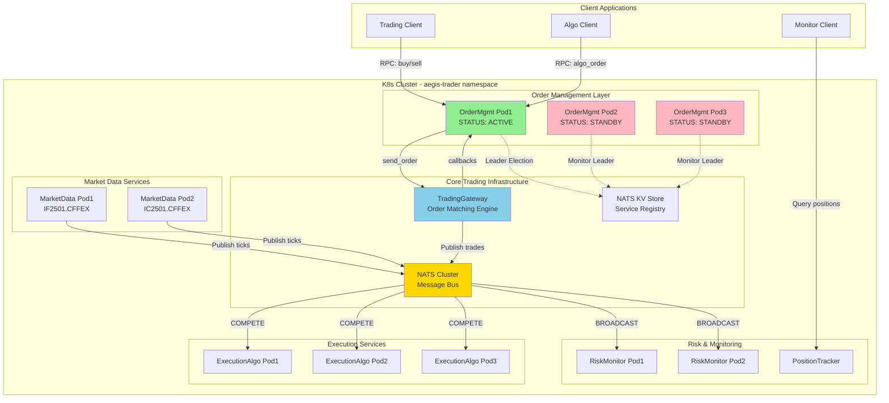
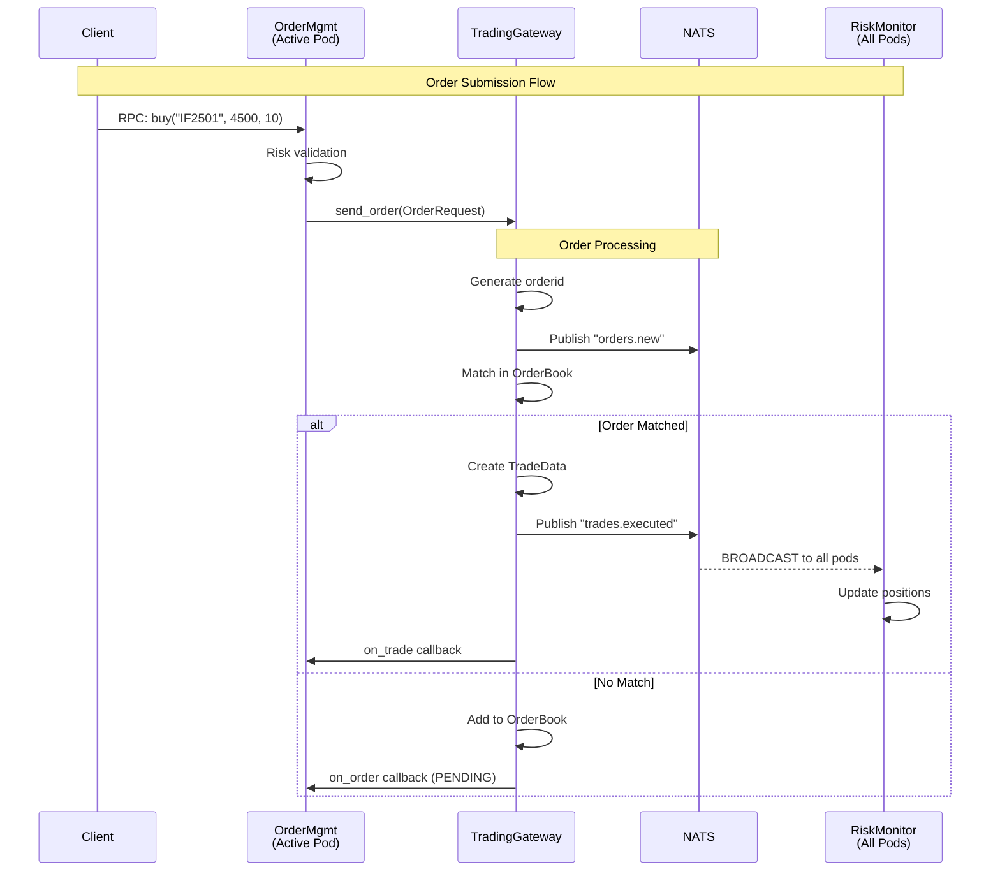
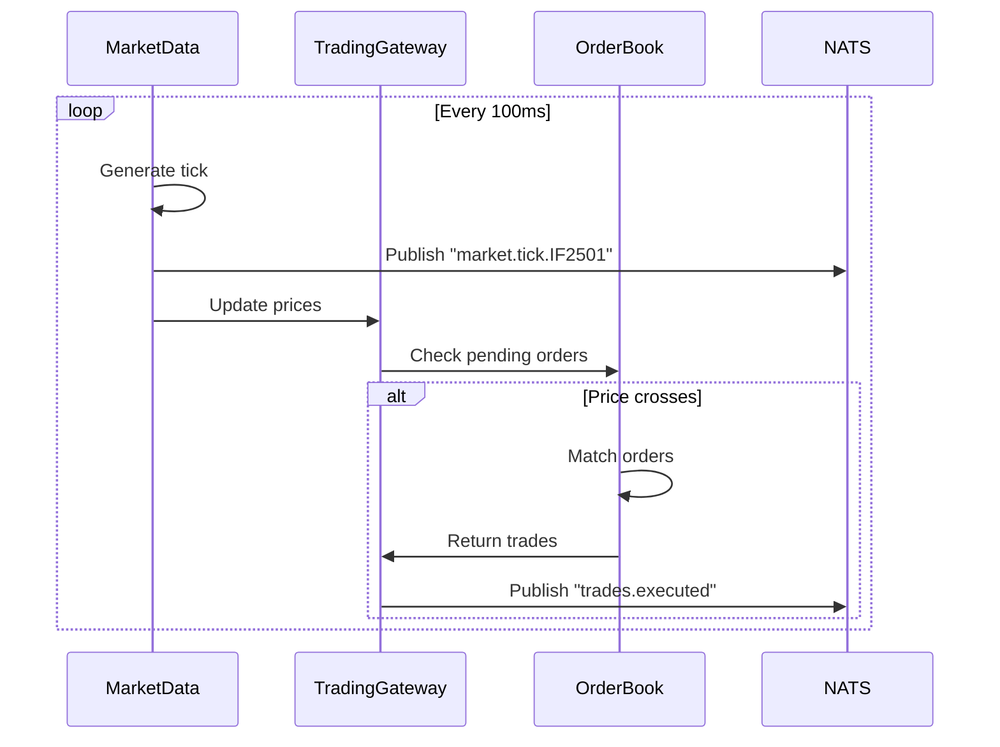
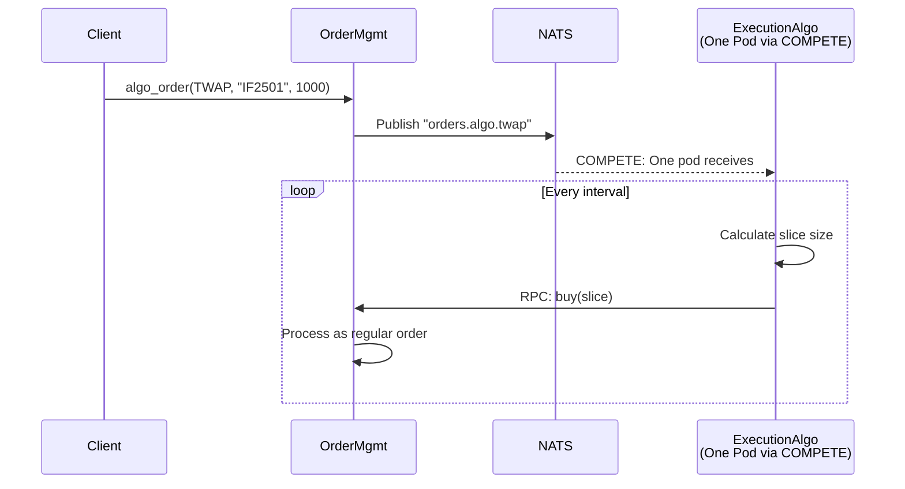

# Trading Simulator Architecture

## Overview
The Trading Simulator is a comprehensive example that validates critical AegisSDK patterns by simulating a complete trading system with order matching engine, similar to vnpy_ctp.

## System Architecture

### Component Overview



## Data Flow Sequences

### 1. Order Submission and Execution



### 2. Market Data and Matching



### 3. Algo Order Processing



## Event Topics and Subscription Patterns

### Topic Structure

| Topic Pattern | Data Type | Publishers | Description |
|--------------|-----------|------------|-------------|
| `market.tick.{symbol}` | TickData | MarketData | Real-time market quotes |
| `orders.new` | OrderData | TradingGateway | New order notifications |
| `orders.filled` | OrderData | TradingGateway | Filled order notifications |
| `orders.cancelled` | OrderData | OrderMgmt | Cancelled orders |
| `trades.executed` | TradeData | TradingGateway | Executed trades |
| `orders.algo.twap` | AlgoOrder | OrderMgmt | TWAP algo orders |
| `orders.algo.vwap` | AlgoOrder | OrderMgmt | VWAP algo orders |

### Subscription Modes

| Component | Topic Pattern | Mode | Behavior |
|-----------|--------------|------|----------|
| RiskMonitor | `trades.*` | BROADCAST | All pods receive every trade |
| PositionTracker | `trades.*` | BROADCAST | All pods maintain full position view |
| ExecutionAlgo | `orders.algo.*` | COMPETE | Only one pod processes each algo order |
| MarketRecorder | `market.tick.*` | BROADCAST | All pods can record market data |

## SDK Pattern Validation

### 1. SingleActiveService Pattern

**Component**: OrderManagementService

**Validation Points**:
- ✅ 3 pods deployed (1 active, 2 standby)
- ✅ Leader election via NATS KV Store
- ✅ Only active pod processes RPC requests
- ✅ Client automatic retry on NOT_ACTIVE errors
- ✅ Failover completes within 2 seconds
- ✅ State preserved across failovers

### 2. Event Publishing Pattern

**Components**: MarketDataService, TradingGateway

**Validation Points**:
- ✅ Multiple pods can publish to same topic namespace
- ✅ Events delivered reliably via NATS
- ✅ Concurrent event publishing supported
- ✅ Event ordering preserved per publisher

### 3. BROADCAST Subscription Mode

**Component**: RiskMonitor

**Validation Points**:
- ✅ All pods receive every event
- ✅ Each pod maintains complete state
- ✅ Position consistency across pods
- ✅ No event loss during pod scaling

### 4. COMPETE Subscription Mode

**Component**: ExecutionAlgo

**Validation Points**:
- ✅ Only one pod processes each event
- ✅ Load balanced across available pods
- ✅ No duplicate processing
- ✅ Automatic rebalancing on pod changes

### 5. Observability Pattern

**Component**: PositionTracker

**Validation Points**:
- ✅ ServiceInstance.metadata enriched with metrics
- ✅ Real-time position aggregation
- ✅ Metrics exposed to monitor-api
- ✅ Health status reporting

## Component Implementation Details

### TradingGateway (Order Matching Engine)

```python
class TradingGateway:
    """Simulated CTP gateway with order matching"""

    def __init__(self):
        self.order_books = {}  # symbol -> OrderBook
        self.orders = {}       # orderid -> OrderData
        self.positions = {}    # account -> PositionData

    async def send_order(self, req: OrderRequest) -> str:
        """Process new order request"""
        # 1. Generate unique order ID
        orderid = self._generate_orderid(req.symbol)

        # 2. Create order with PENDING status
        order = self._create_order(req, orderid)

        # 3. Publish new order event
        await self.publish("orders.new", order)

        # 4. Submit to matching engine
        trades = await self.match_order(order)

        # 5. Process any resulting trades
        for trade in trades:
            await self.process_trade(trade)

        return orderid
```

### OrderBook (Price-Time Priority)

```python
class OrderBook:
    """Order book with price-time priority matching"""

    def match_order(self, order: OrderData) -> list[TradeData]:
        """Match order against book"""
        trades = []

        if order.direction == Direction.LONG:
            # Buy order matches against asks
            opposite_side = self.asks
            can_match = lambda o: order.price >= o.price
        else:
            # Sell order matches against bids
            opposite_side = self.bids
            can_match = lambda o: order.price <= o.price

        while opposite_side and order.volume > 0:
            best = opposite_side[0]
            if can_match(best):
                trade = self.execute_trade(order, best)
                trades.append(trade)
            else:
                break

        # Add remaining volume to book
        if order.volume > 0:
            self.add_to_book(order)

        return trades
```

### OrderManagementService (SingleActive)

```python
class OrderManagementService(SingleActiveService):
    """Order management with single-active pattern"""

    @rpc_handler
    async def buy(self, symbol: str, price: float, volume: float):
        """Handle buy order request"""
        # Only active instance processes
        if not self.is_active():
            raise NotActiveError("Retry with active instance")

        # Validate order
        if not await self.validate_order(symbol, price, volume):
            raise ValidationError("Order failed validation")

        # Send to gateway
        orderid = await self.gateway.send_order(
            OrderRequest(
                symbol=symbol,
                direction=Direction.LONG,
                price=price,
                volume=volume
            )
        )

        return {"orderid": orderid, "status": "submitted"}
```

## Deployment Configuration

### Kubernetes Manifests

```yaml
# trading-simulator-deployment.yaml
apiVersion: apps/v1
kind: Deployment
metadata:
  name: trading-gateway
  namespace: aegis-trader
spec:
  replicas: 1
  selector:
    matchLabels:
      app: trading-gateway
  template:
    metadata:
      labels:
        app: trading-gateway
    spec:
      containers:
      - name: gateway
        image: trading-simulator:latest
        env:
        - name: COMPONENT
          value: "gateway"
        - name: NATS_URL
          value: "nats://aegis-trader-nats:4222"
---
apiVersion: apps/v1
kind: Deployment
metadata:
  name: order-management
  namespace: aegis-trader
spec:
  replicas: 3
  selector:
    matchLabels:
      app: order-management
  template:
    metadata:
      labels:
        app: order-management
    spec:
      containers:
      - name: ordermgmt
        image: trading-simulator:latest
        env:
        - name: COMPONENT
          value: "order-management"
        - name: SINGLE_ACTIVE
          value: "true"
```

### Helm Values

```yaml
# values.yaml
global:
  namespace: aegis-trader
  image: trading-simulator:latest

services:
  gateway:
    replicas: 1
    resources:
      requests:
        memory: "256Mi"
        cpu: "100m"

  orderManagement:
    replicas: 3
    singleActive: true
    resources:
      requests:
        memory: "128Mi"
        cpu: "50m"

  marketData:
    replicas: 2
    symbols:
      - IF2501.CFFEX
      - IC2501.CFFEX

  riskMonitor:
    replicas: 2
    subscriptionMode: BROADCAST

  executionAlgo:
    replicas: 3
    subscriptionMode: COMPETE

nats:
  url: nats://aegis-trader-nats:4222

monitoring:
  enabled: true
  interval: 10s
```

## Testing and Validation

### Test Scenarios

1. **SingleActive Failover Test**
   - Kill active OrderMgmt pod
   - Verify new leader election < 2 seconds
   - Confirm orders continue processing
   - Check no duplicate order execution

2. **BROADCAST Mode Test**
   - Generate trades
   - Verify all RiskMonitor pods receive
   - Check position consistency across pods
   - Scale pods and verify new pods sync

3. **COMPETE Mode Test**
   - Send multiple algo orders
   - Verify distribution across ExecutionAlgo pods
   - Check no duplicate processing
   - Kill pod and verify rebalancing

4. **Order Matching Test**
   - Submit buy/sell orders
   - Verify price-time priority matching
   - Check trade generation accuracy
   - Validate position updates

### Performance Metrics

| Metric | Target | Measurement |
|--------|--------|-------------|
| Order latency (p99) | < 10ms | Time from RPC to orderid return |
| Trade matching | < 1ms | Time to match in OrderBook |
| Failover time | < 2s | Time to elect new leader |
| Event delivery | < 5ms | Time from publish to subscribe |
| Position sync | < 100ms | Time to update all monitors |

## Summary

The Trading Simulator provides a comprehensive validation environment for AegisSDK patterns by implementing a realistic trading system that:

1. **Validates SingleActiveService** through OrderManagement with leader election
2. **Tests Event Patterns** with market data publishing and trade notifications
3. **Demonstrates BROADCAST/COMPETE** modes with risk monitoring and algo execution
4. **Shows Observability** through position tracking and metadata enrichment
5. **Mimics Real Trading** with order matching engine similar to vnpy_ctp

This example serves as both a learning tool and a validation suite for the SDK's distributed patterns in a production-like Kubernetes environment.
