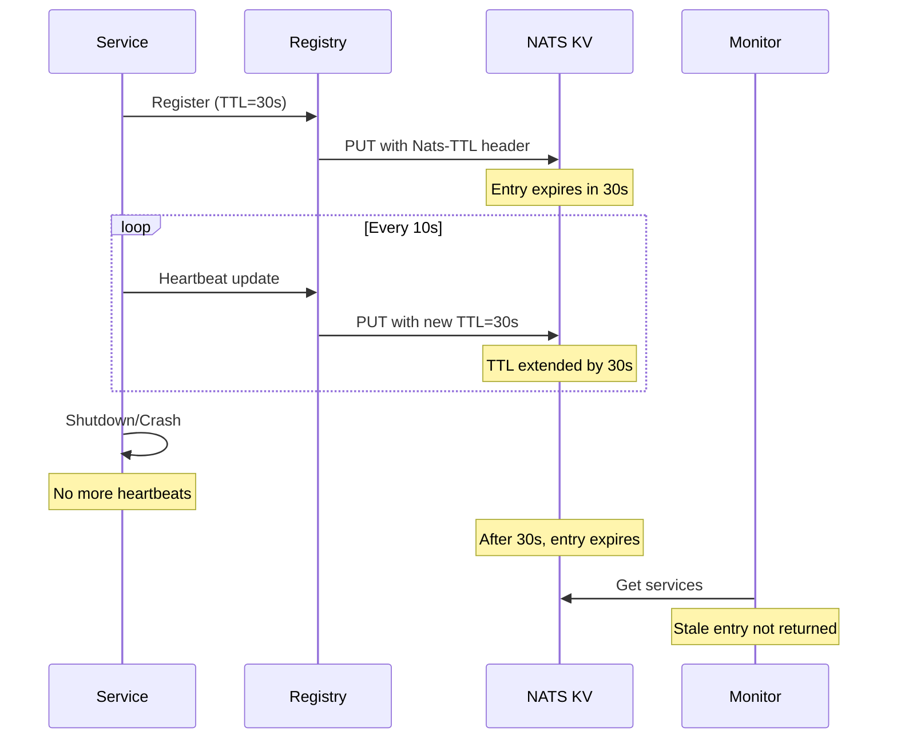

# TTL (Time-To-Live) Behavior Documentation

## Overview
The AegisSDK uses NATS KV Store with per-message TTL to automatically expire stale service registrations. This ensures the service registry accurately reflects the real-time state of the system.

## How TTL Works

### For New Entries
- **TTL is set on creation**: When a service registers or updates its heartbeat, a TTL of 30 seconds is applied
- **Automatic expiration**: NATS automatically removes entries after the TTL expires
- **No manual cleanup needed**: The system self-maintains by expiring stale entries

### For Pre-Existing Entries (Legacy)
- **No retroactive TTL**: Entries created before TTL support was enabled persist indefinitely
- **Manual cleanup required**: Use the `cleanup_stale_services.py` script to remove these entries
- **One-time migration**: After cleanup, all new entries will have TTL

## TTL Configuration

### Default Settings
```python
# Service registration TTL (seconds)
DEFAULT_TTL = 30

# Stale threshold for filtering (TTL + buffer)
STALE_THRESHOLD = 35  # 30s TTL + 5s buffer
```

### Per-Message TTL Requirements
- NATS Server 2.11+ required
- JetStream KV bucket must have `allow_msg_ttl: true`
- Configured automatically by SDK when creating buckets

## Service Lifecycle with TTL



## Cleanup Tools

### Manual Cleanup Script
```bash
# Dry run to see what would be deleted
python scripts/cleanup_stale_services.py --dry-run

# Actually remove stale entries
python scripts/cleanup_stale_services.py

# Specify custom NATS URL
python scripts/cleanup_stale_services.py --nats-url nats://10.0.0.1:4222
```

### What Gets Cleaned
1. Entries with heartbeats older than 35 seconds
2. Entries with status UNHEALTHY or SHUTDOWN
3. Entries without TTL metadata (pre-TTL era)

## Monitor-API Filtering

As an additional safety net, the monitor-api filters entries before returning them:

```python
def is_stale(instance: ServiceInstance) -> bool:
    """Check if a service instance is stale."""
    now = datetime.now(UTC)
    heartbeat_age = now - instance.last_heartbeat
    return heartbeat_age > timedelta(seconds=35)
```

This ensures that even if TTL fails or entries persist, the UI won't show stale services.

## Testing TTL

### Verify TTL is Working
```python
# Run TTL verification test
cd packages/aegis-sdk
pytest tests/integration/test_ttl_verification.py -v
```

### Manual TTL Test
```python
from aegis_sdk.domain.models import KVOptions

# Put entry with 5 second TTL
await kv_store.put("test-key", {"data": "test"}, options=KVOptions(ttl=5))

# Entry exists immediately
entry = await kv_store.get("test-key")
assert entry is not None

# Wait for TTL to expire
await asyncio.sleep(6)

# Entry is automatically removed
entry = await kv_store.get("test-key")
assert entry is None
```

## Troubleshooting

### TTL Not Working?
1. Check NATS server version: `nats-server --version` (need 2.11+)
2. Verify bucket has TTL enabled: Check stream config for `allow_msg_ttl: true`
3. Look for errors in logs when setting TTL
4. Run the TTL verification test

### Stale Entries Persist?
1. They might be pre-TTL entries - run cleanup script
2. Check if monitor-api filtering is working
3. Verify service heartbeat intervals (should be < 30s)

### Performance Considerations
- TTL operations add minimal overhead (~1ms per PUT)
- NATS handles expiration in background
- No polling or active cleanup needed for TTL-enabled entries
- Monitor-API filtering adds < 1ms to response time

## Best Practices

1. **Always set TTL on service registration**: Use the SDK's built-in registration methods
2. **Heartbeat interval < TTL/3**: For 30s TTL, heartbeat every 10s
3. **Monitor for pre-TTL entries**: Run cleanup script periodically until all legacy entries are gone
4. **Use filtering as backup**: Always filter stale entries in consumer code
5. **Test failover scenarios**: Ensure services disappear promptly when stopped
