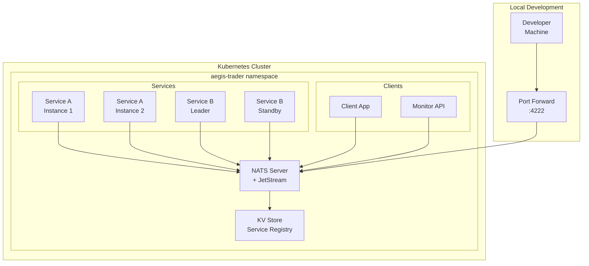
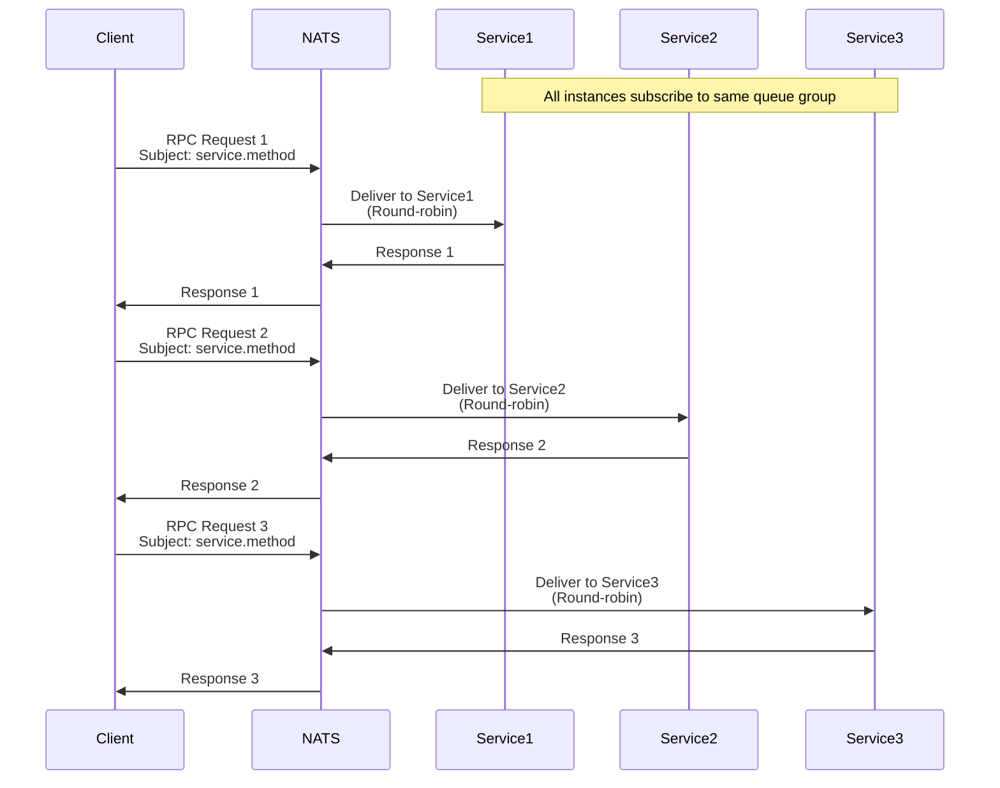
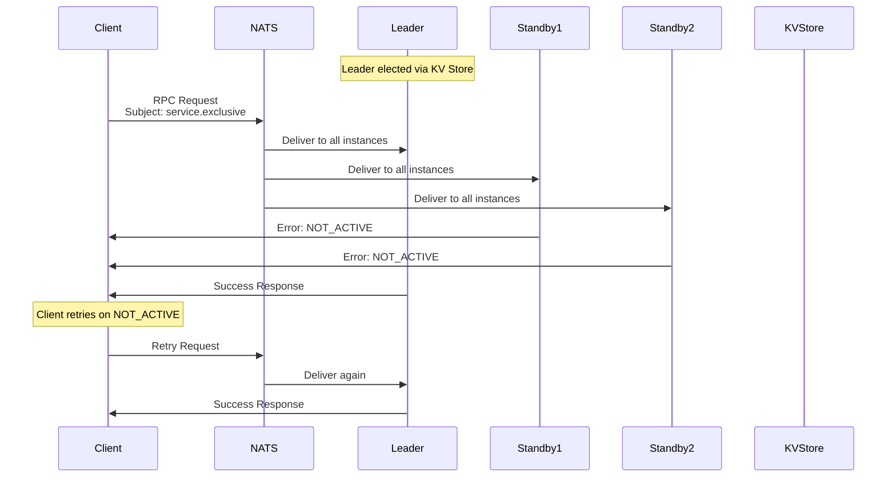
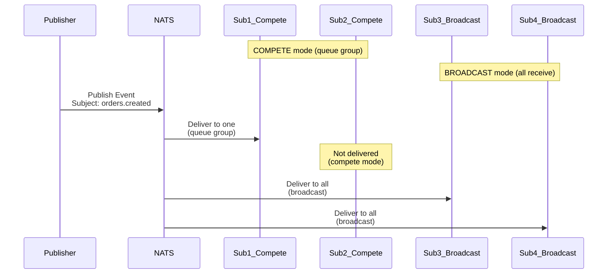
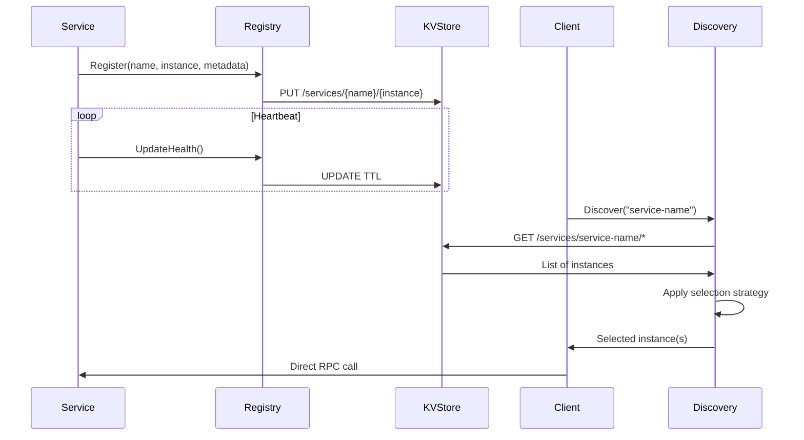
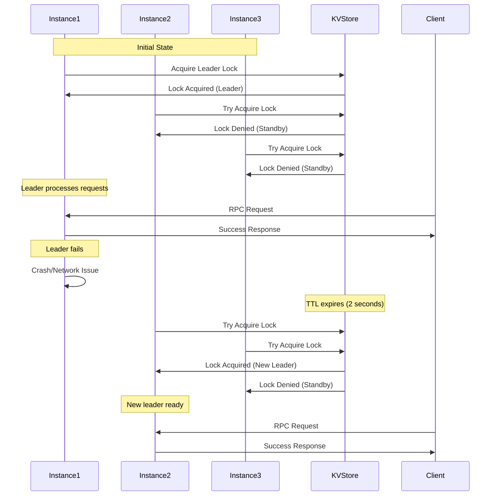
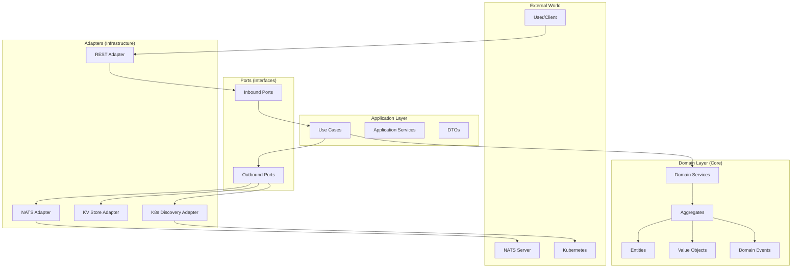

# AegisSDK Architecture Diagrams

Visual representations of SDK architecture, message flows, and patterns.

## Table of Contents

1. [System Overview](#system-overview)
2. [Message Flow Patterns](#message-flow-patterns)
3. [Service Discovery Flow](#service-discovery-flow)
4. [Failover Sequence](#failover-sequence)
5. [DDD Layer Architecture](#ddd-layer-architecture)

---

## System Overview

### High-Level Architecture



### Component Interaction

```
┌─────────────────────────────────────────────────────────────┐
│                     Kubernetes Cluster                       │
│                                                              │
│  ┌──────────────────────────────────────────────────────┐   │
│  │                   NATS + JetStream                    │   │
│  │                                                       │   │
│  │  ┌─────────────┐  ┌──────────────┐  ┌────────────┐  │   │
│  │  │   Pub/Sub   │  │     RPC      │  │  KV Store  │  │   │
│  │  │   Events    │  │   Requests   │  │  Registry  │  │   │
│  │  └─────────────┘  └──────────────┘  └────────────┘  │   │
│  └──────────────────────────────────────────────────────┘   │
│                            ▲                                 │
│         ┌──────────────────┼──────────────────┐             │
│         │                  │                  │             │
│    ┌────▼─────┐      ┌────▼─────┐      ┌────▼─────┐       │
│    │ Service  │      │ Service  │      │ External │       │
│    │ Pattern  │      │ Pattern  │      │  Client  │       │
│    │  (Load   │      │ (Single  │      │ (Monitor)│       │
│    │ Balanced)│      │  Active) │      │          │       │
│    └──────────┘      └──────────┘      └──────────┘       │
│                                                              │
└─────────────────────────────────────────────────────────────┘
                              ▲
                              │ Port Forward
                              │ localhost:4222
                              │
                    ┌─────────▼──────────┐
                    │   Developer PC     │
                    │  ┌──────────────┐  │
                    │  │  AegisSDK    │  │
                    │  │  Application │  │
                    │  └──────────────┘  │
                    └────────────────────┘
```

---

## Message Flow Patterns

### 1. Load-Balanced RPC Pattern



**ASCII Flow:**
```
     Request Distribution (Load-Balanced)

Client ──────► NATS Queue Group ──────► Service Instances
                     │
                     ├──► Request 1 ──► Instance 1
                     ├──► Request 2 ──► Instance 2
                     └──► Request 3 ──► Instance 3

        Automatic round-robin distribution
```

### 2. Single-Active RPC Pattern



**ASCII Flow:**
```
     Single-Active Pattern with Client Retry

            ┌─────────────────┐
            │   Client App    │
            └────────┬────────┘
                     │ RPC Request
                     ▼
            ┌─────────────────┐
            │      NATS       │
            └────────┬────────┘
                     │ Broadcast to all
       ┌─────────────┼─────────────┐
       ▼             ▼             ▼
  ┌─────────┐  ┌─────────┐  ┌─────────┐
  │ LEADER  │  │STANDBY 1│  │STANDBY 2│
  │ Process │  │ Reject  │  │ Reject  │
  └─────────┘  └─────────┘  └─────────┘
       │            │             │
       │            └─────┬───────┘
       │                  │ NOT_ACTIVE
       │                  ▼
       │            ┌─────────┐
       └───────────►│ Client  │
         Success    │ Retries │
                    └─────────┘
```

### 3. Event Publishing Pattern



**ASCII Flow:**
```
     Event Distribution Patterns

Publisher ──► NATS ──► Subject: orders.created
                │
                ├──► COMPETE Mode (Queue Group)
                │    └──► One of [Sub1, Sub2] receives
                │
                └──► BROADCAST Mode
                     ├──► Sub3 receives
                     └──► Sub4 receives
```

---

## Service Discovery Flow

### Registration and Discovery Sequence



**ASCII Representation:**
```
  Service Registration & Discovery Flow

    Service Instance                Client Application
           │                               │
           ▼                               ▼
    ┌──────────────┐              ┌──────────────┐
    │   Register   │              │   Discover   │
    └──────┬───────┘              └───────┬──────┘
           │                               │
           ▼                               ▼
    ┌──────────────────────────────────────┐
    │          KV Store Registry           │
    │                                       │
    │  /services/                          │
    │    ├── echo/                         │
    │    │   ├── instance-1 [metadata]     │
    │    │   ├── instance-2 [metadata]     │
    │    │   └── instance-3 [metadata]     │
    │    └── order/                        │
    │        └── instance-1 [metadata]     │
    └──────────────────────────────────────┘
           ▲                               │
           │                               │
      Heartbeat                     Instance List
       (TTL)                              │
           │                               ▼
    Keep Alive                    Selection Strategy
                                   (Round-Robin/Random)
```

---

## Failover Sequence

### Leader Election and Failover



**Failover Timeline:**
```
Time  │ Event
──────┼────────────────────────────────────────
0.0s  │ Instance1 is LEADER
      │ Instance2, Instance3 are STANDBY
      │
1.0s  │ Instance1 sends heartbeat ♥
      │
2.0s  │ Instance1 sends heartbeat ♥
      │
3.0s  │ ✗ Instance1 FAILS (crash/network)
      │
4.0s  │ Heartbeat missed (detection)
      │
5.0s  │ TTL expires in KV Store
      │ Election triggered
      │
5.5s  │ Instance2 attempts lock acquisition
      │ Instance3 attempts lock acquisition
      │
5.8s  │ Instance2 becomes NEW LEADER
      │ Instance3 remains STANDBY
      │
      │ Total Failover Time: 2.8 seconds
```

---

## DDD Layer Architecture

### Hexagonal Architecture Implementation



**Layer Responsibilities:**

```
┌─────────────────────────────────────────────┐
│            Infrastructure Layer             │
│                                             │
│  • NATS Adapter (messaging)                │
│  • KV Store Adapter (persistence)          │
│  • K8s Discovery (environment)             │
│  • Logging, Metrics, Clock                 │
└─────────────────▲───────────────────────────┘
                  │ implements
┌─────────────────▼───────────────────────────┐
│              Ports Layer                    │
│                                             │
│  • MessageBusPort (interface)              │
│  • ServiceRegistryPort (interface)         │
│  • ServiceDiscoveryPort (interface)        │
│  • MetricsPort (interface)                 │
└─────────────────▲───────────────────────────┘
                  │ uses
┌─────────────────▼───────────────────────────┐
│           Application Layer                 │
│                                             │
│  • Use Cases (RegisterService, etc.)       │
│  • Application Services (orchestration)    │
│  • DTOs (data transfer)                    │
│  • Dependency Injection                    │
└─────────────────▲───────────────────────────┘
                  │ orchestrates
┌─────────────────▼───────────────────────────┐
│             Domain Layer                    │
│                                             │
│  • Aggregates (ServiceAggregate)           │
│  • Entities (ServiceInfo, ElectionInfo)    │
│  • Value Objects (ServiceName, Status)     │
│  • Domain Services (HealthCheck, Election) │
│  • Domain Events (ServiceRegistered)       │
└─────────────────────────────────────────────┘

        Dependencies flow inward only
         Domain has zero dependencies
```

### Data Flow Through Layers

```
  Incoming RPC Request Flow:

     Network                Infrastructure            Application              Domain
        │                         │                         │                    │
   RPC Request ──────► NATS Adapter ──────► RPC Handler ──────► Use Case ──────► Service
        │                         │                         │                    │
        │                    Parse JSON                Validate DTO         Business Logic
        │                         │                         │                    │
        │                    Route to                  Orchestrate           Apply Rules
        │                    Handler                   Dependencies               │
        │                         │                         │                    │
   RPC Response ◄────── Serialize ◄────────── DTO ◄──────────── Result ◄─────────┘
        │                         │                         │                    │

  Service Registration Flow:

     Application              Domain                  Ports              Infrastructure
         │                      │                      │                      │
    Register ──────► ServiceAggregate ──────► RegistryPort ──────► KV Store Adapter
    Command          Create Instance          Interface            NATS KV
         │                      │                      │                      │
         │                 Validate                Abstract            Concrete
         │                 Invariants             Storage            Implementation
         │                      │                      │                      │
    Success ◄────────── Event ◄──────────── Confirmation ◄──────── KV Response
    Response          ServiceRegistered
```

---

## Pattern Decision Tree

```
                    Which Pattern to Use?
                           │
                           ▼
                  ┌─────────────────┐
                  │ Need to provide │
                  │    a service?   │
                  └────────┬────────┘
                     Yes │ │ No
                ┌────────┘ └────────┐
                ▼                    ▼
        ┌─────────────┐      ┌─────────────┐
        │  Stateful?  │      │  External   │
        └──────┬──────┘      │   Client    │
          Yes │ │ No         │  (Monitor)  │
      ┌───────┘ └───────┐    └─────────────┘
      ▼                 ▼
┌─────────────┐   ┌─────────────┐
│   Single    │   │    Load     │
│   Active    │   │  Balanced   │
│  Service    │   │   Service   │
└─────────────┘   └─────────────┘
      │                 │
      ▼                 ▼
 Only leader      All instances
 processes          process
  requests          requests
```

---

## Monitoring and Observability

```
     Service Metrics Flow

Service ──► Metrics ──► Metadata ──► Registry ──► Monitor
Instance    Collector   Enrichment    (KV)        API/UI
   │           │            │           │            │
   │      Collect      Aggregate    Store in     Query &
   │      - Latency    - Health     Instance     Display
   │      - Errors     - Grade      Metadata
   │      - Count      - Score
   │
   └──► Performance Tracking
        - Request Rate: 1234 req/min
        - Error Rate: 0.12%
        - P50 Latency: 12ms
        - P99 Latency: 145ms
        - Health Score: 98.5/100
```

---

## Quick Reference Diagrams

### Service Lifecycle
```
 INIT ──► STARTING ──► RUNNING ──► STOPPING ──► STOPPED
             │            │            │
             ▼            ▼            ▼
         Register    Heartbeat    Deregister
          in KV       Active        from KV
```

### Message Types
```
RPC:      Request ──► Response (point-to-point)
Event:    Publish ──► Subscribe (one-to-many)
Command:  Send ──► Execute (directed action)
Stream:   Produce ──► Consume (ordered sequence)
```

### Selection Strategies
```
Round-Robin:  1→2→3→1→2→3 (sequential)
Random:       2→1→3→3→1→2 (random)
Least-Loaded: →[least work]→ (by metrics)
```

---

These diagrams provide a comprehensive view of AegisSDK's architecture and message flows. Use them to understand how components interact and how to design your services effectively.
